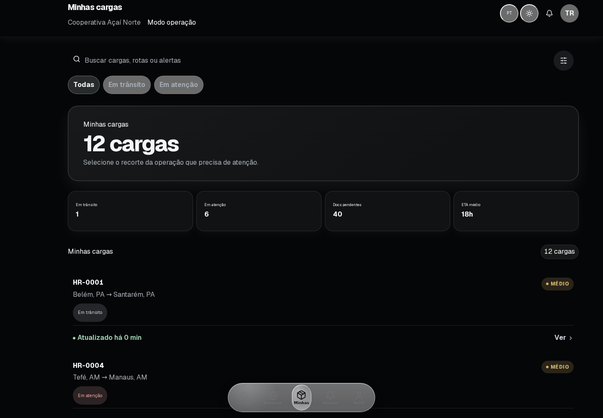
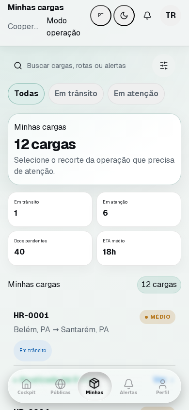
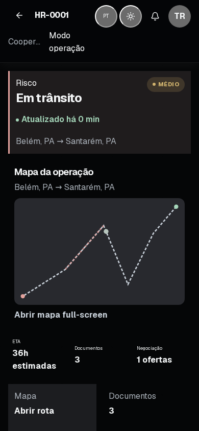

# HydroRivers

Experiência operacional demonstrável para embarcadoras acompanharem cargas em corredores hidroviários brasileiros — da entrada no produto à resolução de pendências documentais.

> Projeto de portfólio em **mock mode**. Os dados são fictícios e determinísticos; não há banco, autenticação ou integração logística real nesta fase.



## O que um avaliador consegue demonstrar

O fluxo principal representa a persona **Embarcadora**:

1. acessar `/` e escolher **Explorar demonstração**;
2. consultar **Minhas Cargas** e seus indicadores operacionais;
3. buscar e filtrar cargas por estado;
4. abrir uma carga e analisar rota, ETA, risco e timeline;
5. navegar por mapa, documentos e negociação;
6. resolver uma pendência documental e observar a mudança de estado e o feedback.

A demonstração também cobre Desktop e Mobile, temas Light e Dark e os idiomas `pt-BR`, `en-US` e `es`.

| Lista operacional | Detalhe da carga |
|---|---|
|  |  |

## Rodar localmente

Requisitos: **Node.js 22** e npm.

```bash
git clone https://github.com/tialaR/hydririvers-ops-dashboard.git
cd hydririvers-ops-dashboard
git switch dev
npm ci
cp .env.example .env.local
npm run dev
```

Abra [http://localhost:3000](http://localhost:3000). A raiz redireciona para o locale padrão e o botão **Explorar demonstração** cria uma sessão da embarcadora fictícia.

Fallback manual:

- e-mail: `tiala@hydrorivers.com`
- senha: `hydro123`
- telefone: `+55 91 99999-0001`
- o OTP fictício aparece na interface quando `HYDRORIVERS_EXPOSE_OTP_CODE=true`

Para restaurar a massa determinística após testes manuais:

```bash
npm run mock-data:reset
```

## Stack e decisões técnicas

- **Next.js 16 / App Router**, React 19 e TypeScript;
- **next-intl** com rotas localizadas e paridade automatizada de 2.645 chaves;
- Sass Modules e Design System com tokens semânticos `--hy-*`;
- Storybook como catálogo vivo de primitives, formulários, feedback e padrões operacionais;
- serviços de domínio e persistência mock server-side isolados para manter a UI substituível;
- sessão mock em cookie e guardas para rotas privadas;
- Vitest para unidade/integração e Playwright para fluxo crítico e regressão visual.

A organização é feature-based: `src/app` compõe rotas, `src/features` concentra domínio e experiência, e `src/shared` contém contratos realmente transversais. As decisões estruturais estão em [`docs/ARCHITECTURE.md`](./docs/ARCHITECTURE.md) e nos [`ADRs`](./docs/adr/README.md).

## Qualidade reproduzível

```bash
npm run verify                 # lint + tipos + i18n + Vitest + mock mode
npm run build                  # build de produção Next.js
npm run build-storybook        # catálogo do Design System
npm run test:shipper-mobile-p0 # fluxo crítico da Embarcadora
npm run test:portfolio-visual  # matriz visual e pixel-diff estável
```

O workflow **Visual Quality** instala Chromium e suas dependências no runner, percorre quatro viewports, três idiomas e dois temas, gera 108 screenshots e compara as telas estáveis com baselines revisados. Mapas dinâmicos entram na prova funcional e nos artefatos, mas não no pixel-diff.

Os gates ativos são **CI**, **PR Quality** e **Visual Quality**. Veja a [estratégia e matriz de evidências](./docs/PORTFOLIO-READY.md).

## Design System e Storybook

```bash
npm run storybook
```

O catálogo inclui primitives semânticas, campos, estados de feedback, cards de carga, rota/ETA, filtros, sheets de mapa/timeline/documentos/riscos e os controles reais do fluxo da Embarcadora. Aplicação e Storybook consomem os mesmos owners semânticos; os adapters preservam a linguagem visual do produto.

Detalhes: [`docs/design-system/STORYBOOK.md`](./docs/design-system/STORYBOOK.md).

## Limites assumidos

Este ciclo prova experiência e engenharia frontend, não produção logística. Permanecem fora do escopo:

- Supabase, banco transacional, autenticação real e APIs externas;
- telemetria, ETA ou posição de embarcação em tempo real;
- upload documental e assinatura com validade jurídica;
- autorização/isolamento de dados com requisitos enterprise;
- outras personas completas além da Embarcadora.

Essas fronteiras são intencionais: o mock mode permite avaliar produto, arquitetura, acessibilidade, responsividade e testes sem apresentar infraestrutura fictícia como produção.

## Leitura rápida para entrevista

- [Case técnico e decisões](./docs/PORTFOLIO-CASE.md)
- [Arquitetura](./docs/ARCHITECTURE.md)
- [Design System e Storybook](./docs/design-system/STORYBOOK.md)
- [Gates de CI](./docs/CI-QUALITY-GATES.md)
- [Acessibilidade](./docs/accessibility.md)
- [Evidências Portfolio-Ready](./docs/PORTFOLIO-READY.md)

---

**Estado desta documentação:** branch `dev`, após os ciclos de integridade do fluxo, prova visual e convergência do Design System. Promoção para `main`, deploy público e higiene histórica pertencem ao ciclo posterior e não são declarados como concluídos aqui.
