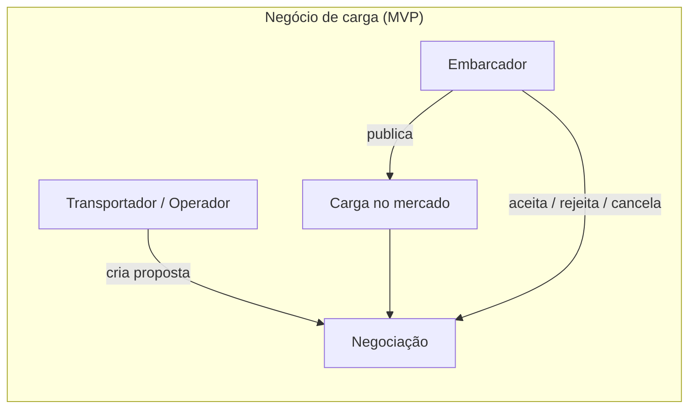
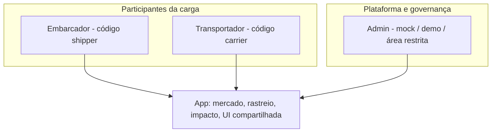
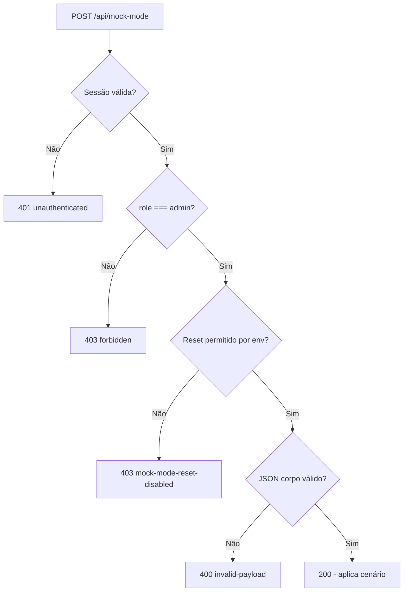
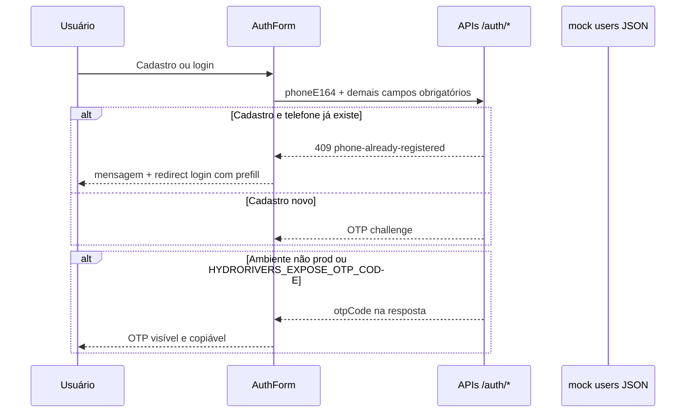
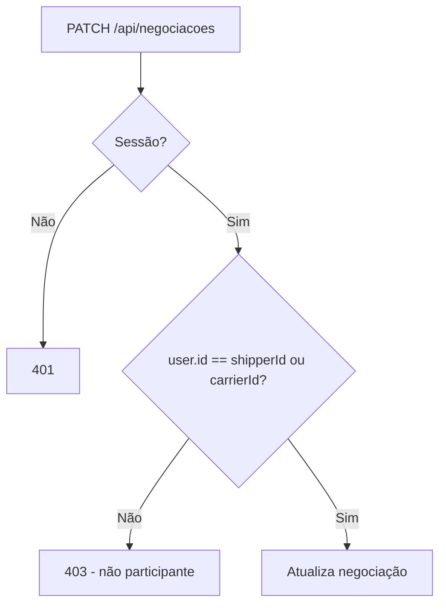
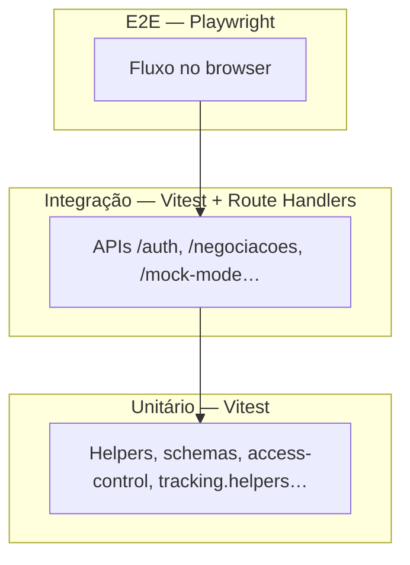
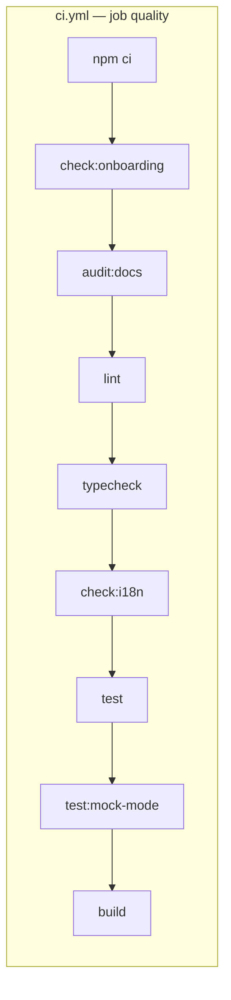
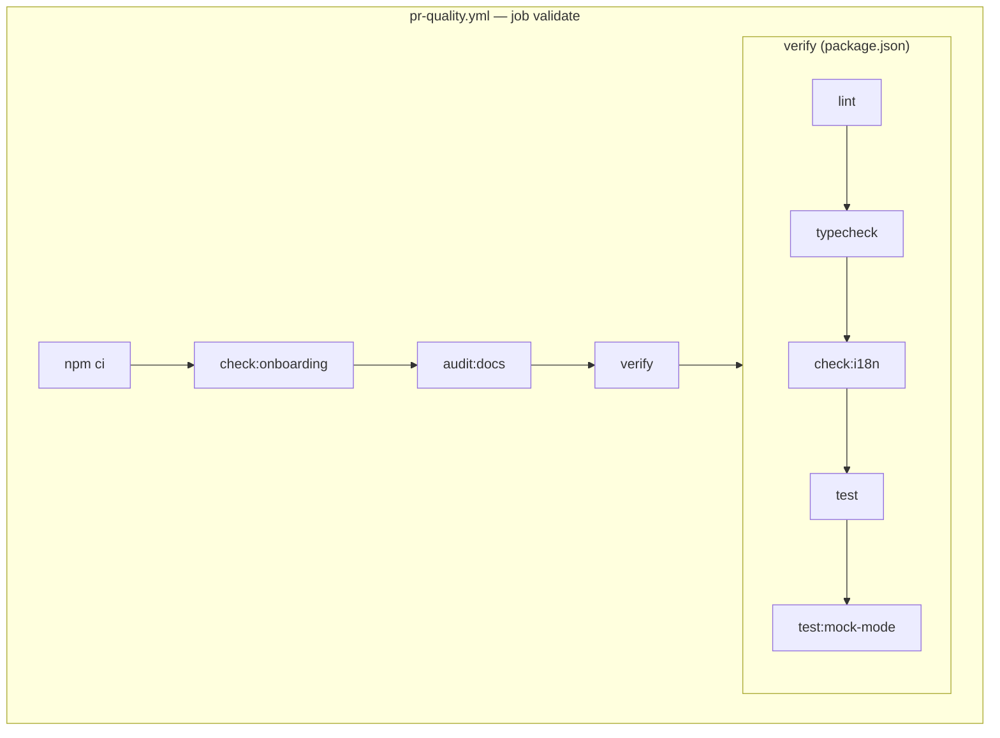
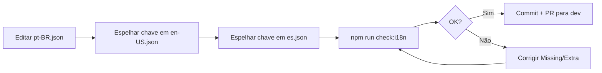
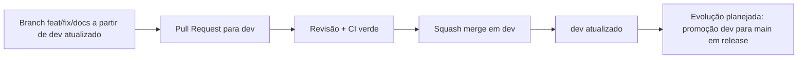

# HydroRivers — Deep Dive (guia técnico para frontend Next.js)

**Tipo:** documentação única — **não altera código nem testes**.  
**Público:** pessoa desenvolvedora **front-end** (Next.js/React) que ainda não domina automação, pirâmide de testes, CI/CD ou padrões **enterprise**.  
**Tom:** profissional, didático e conservador na afirmação: tudo que estiver **implementado no código** está separado do que é **documentado**, **em evolução** ou **roadmap (◇ futuro)**.

**Última referência interna:** `package.json` **0.8.7**, Next **16.2.4**, React **19**. Números de testes e chaves i18n variam por commit — confirme com `npm run test` e `npm run check:i18n`.

---

## 1. Visão geral do HydroRivers

### O que é

O **HydroRivers** é uma **aplicação web** (MVP demonstrável) para **operações logísticas hidroviárias e cabotagem**: centraliza em uma única experiência **oferta de cargas**, **frota (embarcações)**, **negociações**, **rastreio operacional**, **narrativa de impacto** e uma superfície **institucional** (ex.: página `governo`). A persistência atual é **mock server-side** em arquivos JSON — **não** é um TMS/ERP enterprise em produção.

### Qual problema real resolve

- Informação **espalhada** entre embarcadores, transportadores, planilhas e comunicação informal.  
- **Custo de coordenação** e assimetria de dados entre oferta e frota.  
- Dificuldade de **visibilidade agregada** (impacto, gargalos) para políticas e operações — sempre lembrando que números “de demo” **não** são séries oficiais.

### Por que hidrovia precisa de digitalização

Corredores com **conectividade irregular**, documentação sensível e **confiança** entre partes exigem um **canal único** para negociar, acompanhar e explicar o que está acontecendo — mesmo que, neste repositório, ainda como **protótipo** orientado a validação de produto.

### Usuários principais (personas do MVP)

| Persona (produto) | Identificador no código | Papel no produto |
|-------------------|-------------------------|------------------|
| **Embarcador** | `role: 'shipper'` | Possui, publica ou gerencia a **carga**; acompanha negociações em que é parte. |
| **Transportador / Operador** | `role: 'carrier'` | Transporta, opera ou oferece serviço logístico; participa de negociações com política de **aprovação** distinta (ver §2). |
| **Admin / Plataforma** | `role: 'admin'` | Governança, suporte, auditoria, segurança e **cenários mock/demo** — não é dono da carga nem transportador no fluxo operacional típico (ver §2.3). |
| **Institucional / governo** | (audiência de rota) | Persona de produto na rota **governo**; **não** equivale automaticamente a um `role` com os mesmos poderes nas APIs em todos os fluxos. |

### Dores de negócio atacadas (no escopo demonstrável)

- Fragmentação entre **demanda**, **frota** e **acompanhamento**.  
- Falta de um **fluxo único** para estados de carga e negociação (ainda **simulados** com mock).  
- Necessidade de **storytelling** e narrativa de impacto para stakeholders — com **honestidade** sobre o que é métrica narrativa vs. auditoria real.

### Por que o projeto é forte para portfólio

Combina **entrega executável** (Next.js, i18n, testes, CI) com **documentação de segurança e produto** — matriz de APIs, decisões explícitas de `approved`, ownership, limites de mock — e um **roadmap enterprise** sem confundir “especificação em `docs/`” com “já pronto no código”. Isso comunica **maturidade de engenharia** e **transparência** típicas de trabalho sênior (ver também `docs/PORTFOLIO-CASE.md`).

---

## 2. Regras de negócio e papéis (atualizado para produto + código)

Esta seção usa **português de produto** primeiro e indica o **identificador técnico** (`shipper`, `carrier`, `admin`) onde o código e os JSON de mock continuam em inglês — o que evita confusão em PRs e em entrevistas (“o domínio fala português; o contrato técnico é estável”).

### 2.1 Papéis de negócio (participam da carga)

**Embarcador** (`role: 'shipper'`) — quem **possui, publica ou gerencia** a carga no fluxo comercial demonstrável. No cadastro público atual tende a **`approved: true`**, para destravar o núcleo do MVP (ver `docs/SECURITY-PRODUCT-DECISIONS.md`).

**Transportador / Operador** (`role: 'carrier'`) — quem **transporta, opera ou oferece serviço logístico** em torno da carga. Explora mercado, envia propostas e participa de negociações; no cadastro tende a **`approved: false`** até existir moderação explícita (**◇ evolução planejada**).

**Permissões parecidas, não idênticas:** o código separa ações por `role`, `approved` e recurso (ex.: `POST /api/cargas` vs `POST /api/negociacoes`). Não assuma paridade total entre embarcador e transportador sem ler `src/features/auth/domain/access-control.ts` e a matriz em `docs/API-SECURITY-AUDIT.md`.

### 2.2 Papéis de plataforma e governança (Admin / Plataforma)

**Admin / Plataforma** (`role: 'admin'`) — **não** é participante central do fluxo operacional de carga: **não** é dono da carga nem transportador no modelo mental de produto. Concentra **governança**, **suporte**, **auditoria**, **segurança** e **controle de ambiente mock/demo** (cenários via `POST /api/mock-mode`, área administrativa na UI).

**Negociação (implementado hoje):** `POST /api/negociacoes` exige `role === 'carrier'` e usuário **aprovado**; o embarcador da carga entra como `shipperId` derivado de `cargo.ownerId` — não “abre” negociação por esse POST. `PATCH /api/negociacoes` só permite alteração se `user.id` for **`shipperId` ou `carrierId`** da negociação. Um admin genérico **não** passa nesse teste de participante → **403** (comportamento útil para mostrar separação negócio vs plataforma).

**◇ Futuro / evolução planejada:** fluxo explícito “suporte/auditoria age com permissão registada” (carimbo, motivo, trilho) — **só documentar como entregue** quando existir rota + testes; até lá é proposta.

### 2.3 O que o sistema organiza (com honestidade de MVP)

O produto digital organiza **visibilidade** e **decisão** em torno da operação hidroviária: **mercado de cargas**, **negociação**, **rastreio** (timeline), **impacto** (narrativa e evidências demonstrativas), **documentos** como campos/artefactos de UI e mock — **não** substitui ainda um TMS/ERP completo nem fechamento financeiro real.

**◇ Futuro:** custos integrados a sistemas externos, compliance documental pesado, séries oficiais de impacto — ver `docs/ENTERPRISE-ROADMAP.md` e `docs/DATABASE-PLANNING.md`.

### 2.4 Regras de negócio críticas (síntese auditável)

#### Regra 1 — Controlo de ambiente mock / demo (`/api/mock-mode`)

- **Finalidade:** ferramenta de **desenvolvimento**, **QA** e **demo** — **não** é o canal operacional final de transporte.
- **`GET /api/mock-mode`:** metadados do cenário e lista de IDs — **público** no estado auditado (risco documentado em `API-SECURITY-AUDIT.md`).
- **`POST /api/mock-mode`:** apenas sessão **`admin`** pode alterar cenário; `resetMockScenario` em `src/app/api/mock-mode/route.ts`.

| Situação | HTTP | Notas de implementação |
|----------|------|-------------------------|
| Sem sessão | **401** | `unauthenticated` |
| Usuário comum (não admin) | **403** | `forbidden` |
| Admin, reset desactivado por configuração | **403** | `mock-mode-reset-disabled` |
| Corpo JSON inválido / não objeto | **400** | `invalid-payload` (`invalid-json`) — `parseMockModeBody` devolve erro **sem** chamar `resetMockScenario` |
| Admin válido + payload válido + reset permitido | **200** | Resposta com `activeScenario` e contagens |

#### Regra 2 — Telefone como identificador único (mock de usuários)

- **Unicidade:** o cadastro verifica colisão por **`phoneE164`** na lista de usuários mock (`src/app/api/auth/register/route.ts` + `isPhoneE164Taken`).
- **Telefone já cadastrado:** a API devolve `phone-already-registered`; a **UI** do cadastro redireciona para **login** com `?prefill=` (mesmo número nacional) para seguir **login → OTP**, em vez de forçar novo cadastro completo (`src/features/auth/components/auth-form/auth-form.tsx`).
- **Campos obrigatórios:** login e cadastro mantêm **todos** os campos e validações Zod existentes; esta documentação **não** os torna opcionais. Ver também `docs/features/auth.md`.
- **OTP em mock:** o código OTP pode ser exposto na resposta quando `NODE_ENV !== 'production'` ou `HYDRORIVERS_EXPOSE_OTP_CODE=true`; a UI mostra bloco **visível e copiável** na etapa OTP em modo demo — requisito de QA e portfólio.

#### Regra 3 — Negociação por participante

- **`PATCH /api/negociacoes`:** só **embarcador da negociação** (`shipperId`) ou **transportador proponente** (`carrierId`) pode alterar estado.
- **`POST /api/negociacoes`:** só **transportador / operador** autenticado e **aprovado** cria proposta; o embarcador reage no `PATCH` (aceitar / rejeitar / etc.).
- **Admin:** não entra como participante por omissão; não há bypass no handler citado.

**◇ Futuro:** papel de auditoria com permissão explícita e trilho — marcar como entregue só com código + testes.

### 2.5 Domínios principais (ligação ao código)

**Cargas** — unidades de demanda. Publicação autenticada: `commitPublishCargo` / `POST /api/cargas` persistem **`ownerId`** e **`shipperId`** (referem-se ao embarcador). Dados só de seed podem divergir.

**Embarcações** — frota; ligadas às negociações quando a proposta referencia embarcação.

**Negociações** — registo com `shipperId` e `carrierId`; regras de participação em §2.4.

**Rastreio** — timeline; modelo em `docs/TRACKING-TIMELINE.md`.

**Impacto** — narrativa e páginas dedicadas; valores **demonstrativos** até existir série oficial.

### 2.6 Diagramas (Mermaid)

#### Fluxo de negócio principal (alto nível)



#### Papéis do sistema vs plataforma



#### Mock-mode (decisão de autorização)



#### Telefone, cadastro e OTP (mock)



#### Autorização em negociação (PATCH)



### 2.7 Códigos HTTP esperados (referência rápida)

| Status | Significado típico neste MVP |
|--------|-------------------------------|
| **200** | Sucesso em leitura ou mutação autorizada. |
| **201** | Criação (ex.: registo, criação de recurso). |
| **400** | Payload inválido (`invalid-payload`, validação). |
| **401** | Sem sessão onde obrigatória (`unauthenticated`). |
| **403** | Autenticado mas não autorizado (`forbidden`, papel, não participante, não aprovado). |
| **404** | Recurso não encontrado. |
| **409** | Conflito (ex.: email ou telefone duplicado no registo). |
| **500** | Falha interna rara — handlers tendem a mapear erros previsíveis para 4xx. |

**Exemplo:** `PATCH /api/negociacoes` sem sessão → **401**; usuário que **não** é embarcador nem transportador daquela negociação → **403**.

### 2.8 Auditoria desta revisão documental (changelog)

| Trecho legado | O que mudou |
|---------------|-------------|
| Vocabulário **Shipper / Carrier** como se fosse o produto | Texto de produto em PT (**Embarcador**, **Transportador / Operador**) + coluna de **identificador no código**. |
| **Admin** misturado com personas operacionais | Seção dedicada **§2.2 Papéis de plataforma e governança**; admin fora do fluxo central de carga. |
| `POST /api/mock-mode` + JSON inválido descrito como **gap** | Alinhado ao **código atual** (`parseMockModeBody` → **400**, sem reset silencioso). |
| Registo com telefone duplicado | Documentado redirect **cadastro → login** com `prefill` (comportamento de UI + API `phone-already-registered`). |
| `messages/en-US.json` na árvore de pastas | Corrigido para **`en-US.json`** (três arquivos: `pt-BR`, `en-US`, `es`). |

### 2.9 O que ainda merece validação contínua no código

- Matriz completa **`docs/API-SECURITY-AUDIT.md`** vs cada novo handler (GETs públicos, risco enterprise).
- **`approved`** e mensagens `user-not-approved` em todos os fluxos de UI.
- **`HYDRORIVERS_EXPOSE_OTP_CODE`** em CI/E2E (já referido em `docs/E2E-PLAYWRIGHT.md`).
- Qualquer **◇ evolução** citada acima — manter marcador até existir PR com testes.

---

## 3. Arquitetura geral — árvore de pastas (espelho didático)

```txt
src/
  app/                    # App Router: páginas, layouts, route handlers
    api/                  # APIs REST (Route Handlers) — /api/*
    [locale]/             # Rotas internacionalizadas (/pt-BR, /en-US, /es)
  core/                   # i18n (routing, navegação)
  features/               # Domínios de produto (auth, marketplace, tracking…)
  shared/                 # UI compartilhada, servidor (mock-db, auth helpers…)
tests/
  unit/                   # Testes rápidos de unidade
  integration/            # Testes de API (Vitest + handlers)
  e2e/                    # Playwright — fluxos de UI
docs/                     # Planejamento, auditoria, roadmap, guias
.mock-data/               # JSON persistido em dev (mock server-side)
.github/
  workflows/              # CI (quality gates)
messages/                 # pt-BR.json, en-US.json, es.json
```

| Pasta | Responsabilidade | O que costuma ter | Como navegar como dev novo |
|--------|------------------|-------------------|----------------------------|
| **`src/app`** | Rotas e colocação de UI por URL; `layout.tsx`/`page.tsx`; APIs em `api/**/route.ts`. | Páginas, loading, metadata, handlers. | Comece por `[locale]/layout` e uma rota simples (`/login`). |
| **`src/app/api`** | Contratos HTTP do MVP (auth, cargas, negociações, mock-mode…). | `route.ts` por método HTTP. | Leia `API-SECURITY-AUDIT.md` ao lado do handler. |
| **`src/features`** | Regras e UI **por domínio**. | Componentes, hooks, serviços client onde existir. | Agrupe por pasta de feature (`auth`, `marketplace`…). |
| **`src/shared`** | Peças reutilizáveis e **código server** compartilhado (mock-db, auth). | UI, helpers, repositório piloto onde aplicável. | Não coloque regra de negócio “solta” se já existe feature. |
| **`src/core`** | Infra de i18n e navegação. | `routing`, navigation helpers. | Antes de trocar URL, ver `routing` e `middleware`. |
| **`tests`** | Pirâmide de testes. | `*.test.ts` Vitest; `e2e/*.spec.ts` Playwright. | Unit → integration (API) → e2e (fluxo). |
| **`docs`** | Verdade de produto/arquitetura/segurança. | Markdowns referenciados neste guia. | Ordem sugerida em `ENTERPRISE-ROADMAP.md` §16. |
| **`.mock-data`** | Persistência local do mock. | `*.json` gerados/embutidos em runtime. | Reset seguro descrito no `README.md`. |
| **`.github/workflows`** | Automação CI. | `quality-gates.yml`. | Ler `CI-QUALITY-GATES.md`. |

---

## 4. Stack técnica (por que cada peça)

| Tecnologia | Por que faz sentido aqui | Onde aparece |
|------------|---------------------------|--------------|
| **Next.js 16 + App Router** | UI e APIs no mesmo app; SSR/SSG e Route Handlers colocados por rota. | `src/app`, `src/app/api`. |
| **React 19** | UI declarativa; ecossistema alinhado ao Next atual. | Componentes em `features` e `shared`. |
| **TypeScript** | Contratos explícitos entre domínio, API e UI (`strict: true` em `tsconfig.json`). | Todo o `src/`, testes em TS. |
| **next-intl** | Produto regional com **3 locales** desde o MVP. | `messages/*`, `src/core/i18n`, layouts. |
| **Sass Modules** | Estilo encapsulado por componente, evitando vazamento global acidental. | `*.module.scss` ao lado dos componentes. |
| **Vitest** | Testes **rápidos** de unidade e integração em Node. | `tests/unit`, `tests/integration`, `npm run test`. |
| **Playwright** | E2E no **browser real** para fluxos de usuário. | `tests/e2e`, `npm run test:e2e`. |
| **GitHub Actions** | CI reproduzível em PR/push. | `.github/workflows/quality-gates.yml`. |
| **Mock server-side** | Iteração e demo **sem** operar DB real ainda; gravação em `.mock-data`. | Handlers + `mock-db` / repositório piloto. |

---

## 5. Next.js App Router (didática resumida)

### Páginas vs API

- **Página** (`page.tsx`): responde a **navegação** do utilizador (HTML React).  
- **Route Handler** (`route.ts` em `app/api/...`): responde a **`fetch`** HTTP — é a “API” REST do projeto.

### `src/app`

- Segmentos de URL = pastas; `layout.tsx` envolve filhos; `[locale]` adiciona o prefixo de idioma.

### Rotas em `src/app/api`

Cada pasta pode exportar funções nomeadas por verbo HTTP:

```ts
// Exemplo conceitual (estrutura típica do projeto)
// src/app/api/recurso/route.ts
export async function GET() {
  return Response.json({ ok: true });
}
```

### Rotas privadas (UI)

O **`middleware.ts`** na raiz verifica cookie `hydrorivers_session` para paths listados (ex.: `/dashboard`, `/perfil` …) e redireciona para `/{locale}/login?next=…` se não houver sessão. **Isto é proteção de navegação**, não substitui endurecer **GETs de API** (ver auditoria).

### i18n e App Router

`next-intl` combina com middleware de locale (`src/core/i18n/routing`) para servir `/pt-BR`, `/en-US`, `/es`. Trocar idioma **preserva path localizado** via `router.replace` no `LocaleSwitcher`.

### Server vs Client Components

Por padrão, componentes em `app/` são **Server Components**. Quando há estado, eventos ou hooks de navegação cliente, usa-se **`'use client'`** no topo do arquivo — padrão visível em `features/` e layouts interativos.

**Exemplo mínimo:**

```tsx
// Servidor: default no App Router
export default function Page() {
  return <main>…</main>;
}

// Cliente: apenas quando necessário
'use client';
export function ClientWidget() {
  return <button type="button">…</button>;
}
```

---

## 6. React e componentes

### Onde ficam

- **`src/features/<domínio>`** — telas e lógica de negócio agrupadas (auth, marketplace, rastreio…).  
- **`src/shared/ui`** — botões, cards, toggles reutilizáveis.  
- **`src/app/[locale]/.../page.tsx`** — “cola” a página importando features.

### UI vs feature vs página

| Tipo | Responsabilidade |
|------|------------------|
| **Componente de UI** | Apresentação reutilizável, pouco ou nenhum domínio. |
| **Feature** | Agrupa regras e telas de um assunto (ex.: `ProfilePanel`). |
| **Página** | Conecta rota → composição de features + layout. |

### Sass Modules

Cada módulo `*.module.scss` exporta classes **locais**, reduzindo conflito de nomes com o restante do app.

### Evitar acoplamento

Prefira **composição** (página importa feature) a “importar o mundo” em um só arquivo gigante; mantenha contratos de dados nos tipos em `domain`/`types` onde existirem.

---

## 7. Mock server-side e `.mock-data`

### Por que existe

Permite **demo imediata**, testes de integração determinísticos e **iteração de produto** sem custo de infraestrutura no MVP — com limites conscientes (concorrência em arquivo, não usar como produção).

### Mock “simples” vs server-side

- **Client-only** (ex.: só `localStorage`) não serve como fonte única de verdade entre abas e SSR.  
- **Server-side** (handlers Next) gravam JSON no disco — útil para **simular** persistência real e ensaiar migração futura.

### Repository boundary

**Implementação parcial:** `GET /api/cargas` pode passar por repositório (`docs/REPOSITORY-BOUNDARY.md`); outras rotas ainda acessam mock direto — **em evolução**.

### Fluxo atual vs futuro

```txt
Hoje (piloto / misto):
Cliente → Route Handler → [ CargoesRepository opcional | mock-db direto ] → .mock-data/*.json

Futuro (◇ planejado):
Cliente → Route Handler → Repositório → Adapter (Postgres) → DB real
```

### Limitações

Concorrência em serverless, backups, transações ACID, autorização em **todas** as leituras — ver `ENTERPRISE-ROADMAP.md` e `DATABASE-PLANNING.md`.

---

## 8. APIs e segurança

### Autenticação vs autorização

- **Autenticação** — “quem é?” (sessão mock, cookie `hydrorivers_session`).  
- **Autorização** — “pode fazer **esta** ação neste recurso?” (papel, participante, `approved`).

### 401 vs 403

- **401** — não autenticado (sem sessão válida).  
- **403** — autenticado, mas política proíbe (papel errado, não participante, não aprovado).

### Rotas principais (leitura humana da auditoria)

Documentação mestra: **`docs/API-SECURITY-AUDIT.md`** — matriz por rota com método, sessão, risco e recomendação. **Importante:** vários **GET** listam coleções **sem exigir sessão** no estado auditado → **alto risco** para um cenário enterprise real; endurecimento é **roadmap**, não promessa do MVP atual.

### Decisões documentadas

Centralizadas em **`docs/SECURITY-PRODUCT-DECISIONS.md`** — incluem `approved`, `ownerId`, separação **Admin / Plataforma** vs fluxo de negociação, e **mock-mode**.

**Exemplo conceitual de corpo de erro:**

```json
{ "error": "forbidden", "reason": "user-not-approved" }
```

---

## 9. Testes — pirâmide e exemplos reais do HydroRivers

A pirâmide combina **rápido feedback** (unitário), **contrato HTTP** (integração) e **confiança de usuário** (E2E). No HydroRivers, os três níveis falam diretamente com o domínio hidroviário: **auth mock**, **telefone único**, **mock-mode (Admin / Plataforma)**, **negociação por participante**, **helpers de rastreio** e **i18n**.



### 9.1 Testes unitários (`tests/unit/`)

**O que são:** funções, helpers e componentes **isolados** — sem subir servidor HTTP completo; execução em milissegundos.

**Para que servem:** travar regras que, se quebrassem, gerariam bugs caros em operações (papéis, validação, inferência de eventos de rastreio).

**Exemplos reais no repositório**

| Arquivo | O que protege |
|----------|----------------|
| `tests/unit/features/marketplace/tracking.helpers.test.ts` | `resolveOperationalTrackingKind` e `OPERATIONAL_TRACKING_EVENT_KINDS` — mapa mental do rastreio operacional. |
| `tests/unit/features/auth/access-control.test.ts` | Permissões por papel (`shipper` / `carrier` / `admin`) alinhadas a `access-control.ts`. |
| `tests/unit/features/auth/auth-schemas.test.ts` | Validação de login/cadastro (campos obrigatórios). |
| `tests/unit/shared/i18n/mock-content.test.ts` | Conteúdo mock e convenções de tradução. |
| `tests/unit/shared/server/mock-db.test.ts` | Leitura/escrita do mock server-side. |

### 9.2 Testes de integração (`tests/integration/api/`)

**O que são:** pedidos HTTP simulados aos **Route Handlers** reais; validam **status**, corpo JSON e **autorização** (401/403/409).

**Por que importam:** reproduzem o contrato que o front chama com `fetch` — sem abrir o browser.

**Exemplos reais no repositório**

| Arquivo | Cenário de produto coberto |
|----------|----------------------------|
| `tests/integration/api/auth.login.post.test.ts` | Login + desafio **OTP** (incl. exposição do código em ambiente de teste quando configurado). |
| `tests/integration/api/auth.register.post.test.ts` | Cadastro; colisão **`phone-already-registered`** (telefone como identificador único no mock). |
| `tests/integration/api/mock-mode.post.test.ts` | **Mock-mode**: só **Admin / Plataforma** altera cenário; 401/403/400 conforme sessão e corpo. |
| `tests/integration/api/mock-mode.login-as.post.test.ts` | Fluxo auxiliar de QA / `login-as` (ambiente controlado). |
| `tests/integration/api/negociacoes.patch.test.ts` | **Negociação por participante** — só `shipperId` ou `carrierId` da negociação pode `PATCH`. |
| `tests/integration/api/negociacoes.post.test.ts` | Criação de proposta por transportador (`role: 'carrier'`) com regras de aprovação. |
| `tests/integration/api/rastreio.get.test.ts` | Leitura de timeline/rastreio na API. |

### 9.3 Testes E2E (`tests/e2e/`)

**O que são:** Playwright (Chromium) executa fluxos como um usuário: navegação, formulários, cookies de sessão.

**Exemplos reais**

| Spec | Foco |
|------|------|
| `tests/e2e/auth.login.spec.ts` | Login e **OTP mock** visível no fluxo de demo. |
| `tests/e2e/admin-mock-mode.spec.ts` | Superfície **mock-mode** com papel admin. |
| `tests/e2e/negociacoes.spec.ts` | Jornada de negociações na UI. |
| `tests/e2e/locale.switch.spec.ts` | Troca de idioma (`pt-BR` / `en-US` / `es`). |

**Limitações práticas:** `npx playwright install chromium`; primeiro `next build` pode ser lento; variáveis como `HYDRORIVERS_EXPOSE_OTP_CODE` no servidor de teste — ver `docs/E2E-PLAYWRIGHT.md`.

**Evolução planejada:** job dedicado no GitHub Actions a correr `npm run test:e2e` em cada PR (hoje **não** está nos workflows listados em `docs/CI-QUALITY-GATES.md`).

### 9.4 Como rodar (comandos)

```bash
npm run test                 # Vitest: unit + integration (vitest.config.ts)
npm run test:unit            # Só tests/unit
npm run test:integration     # Só tests/integration
npm run test:mock-mode       # Subconjunto mock-mode / QA (também no CI principal)
npx playwright install chromium
npm run test:e2e             # Playwright
```

Use `npm run test` no seu commit para ver a **contagem atual** de testes — não dependas de números congelados em Markdown.

---

## 10. CI/CD e quality gates (GitHub Actions)

**CI** aqui significa: a cada **push** ou **pull request**, o GitHub executa workflows que repetem os mesmos comandos que um humano correria antes de aprovar código — reduz regressões em **lint**, **tipos**, **i18n**, **testes** e **build**.

**CD (deploy)** para ambientes externos (ex.: Vercel) **não** está descrito como pipeline automática neste repositório; o foco documentado é **qualidade reproduzível** antes do merge.

### 10.1 Workflows implementados

| Workflow | Arquivo | Quando corre | Destaque |
|----------|----------|--------------|----------|
| **CI** | `.github/workflows/ci.yml` | **Push** (qualquer branch) e **pull_request** | Inclui **`npm run build`**, **`npm run test:mock-mode`**. |
| **PR Quality** | `.github/workflows/pr-quality.yml` | **pull_request** apenas | Corre **`npm run verify`** após onboarding e auditoria de docs (sem `build` no job). |

**Concorrência:** ambos usam `concurrency` + `cancel-in-progress` para não acumular jobs duplicados no mesmo ref.

**Node:** **22** (`ubuntu-latest`), instalação com **`npm ci`**.

### 10.2 Pipeline CI principal (`ci.yml`, job `quality`)

| Ordem | Step / comando | Função |
|------|----------------|--------|
| 1 | `npm run check:onboarding` | Artefatos mínimos de onboarding não desapareceram. |
| 2 | `npm run audit:docs` | `scripts/audit-docs.mjs` — documentação mínima alinhada. |
| 3 | `npm run lint` | ESLint (`eslint.config.mjs`, Next core-web-vitals). |
| 4 | `npm run typecheck` | `tsc --noEmit` — TypeScript sem emitir JS. |
| 5 | `npm run check:i18n` | Paridade de chaves entre `pt-BR`, `en-US`, `es`. |
| 6 | `npm run test` | Suíte Vitest completa (unit + integration). |
| 7 | `npm run test:mock-mode` | Regressão **mock-mode**, cenários mock e APIs relacionadas. |
| 8 | `npm run build` | `next build` — valida bundle de produção. |

### 10.3 Pipeline PR Quality (`pr-quality.yml`, job `validate`)

| Ordem | Comando | Nota |
|------|---------|------|
| 1–2 | `check:onboarding`, `audit:docs` | Igual ao CI. |
| 3 | `npm run verify` | Agrega `lint` → `typecheck` → `check:i18n` → `test` → `test:mock-mode` (ver `package.json`). **Não** inclui `build`. |

**Por que rodar `build` localmente antes do merge:** o job de PR **não** executa `next build`; o push ao **CI** completo sim. Para evitar surpresa, rode `npm run build` na máquina ou confie no run de CI após o push.

### 10.4 Diagrama — CI principal (`ci.yml`)



### 10.5 Diagrama — PR Quality (`pr-quality.yml`)



### 10.6 Espelho local do CI (comandos)

```bash
npm ci
npm run check:onboarding
npm run audit:docs
npm run lint
npm run typecheck
npm run check:i18n
npm run test
npm run test:mock-mode
npm run build
```

### 10.7 Espelho do PR Quality (sem `build`)

```bash
npm ci
npm run check:onboarding
npm run audit:docs
npm run verify
```

**Investigar falhas:** GitHub → **Actions** → workflow **CI** ou **PR Quality** → expandir o step vermelho — detalhes também em `docs/CI-QUALITY-GATES.md`.

### 10.8 Legado corrigido nesta documentação (testes · CI)

| Antes (legado no Deep Dive) | Depois (alinhado ao repo) |
|-----------------------------|---------------------------|
| Referência a `quality-gates.yml` inexistente | Workflows reais: **`ci.yml`** e **`pr-quality.yml`**. |
| CI sem `build` / sem `test:mock-mode` | **`ci.yml`** inclui **`npm run build`** e **`npm run test:mock-mode`**. |
| PR igual ao push | **`pr-quality.yml`** corre **`verify`** (sem build explícito no job). |
| E2E omitido sem contexto | Clarificado como **Evolução planejada** em Actions; localmente `npm run test:e2e`. |

---

## 11. Lint

**O que é:** análise **estática** que aponta padrões problemáticos, acessibilidade básica, imports mortos (conforme regras ativas).

**Configuração:** `eslint.config.mjs` estende **`eslint-config-next/core-web-vitals`** — alinhado a boas práticas Next/React e métricas web.

**Comando:** `npm run lint` (= `eslint .`).

**Evita:** antipadrões comuns, alguns problemas de hooks, imports inválidos — **não** substitui testes nem revisão humana.

---

## 12. TypeScript

**`npm run typecheck`** executa `tsc --noEmit` — compilação de tipos **sem** gerar JS.

**Em produto logístico:** contratos explícitos em **cargas**, **negociações** e **APIs** reduzem bugs de “campo errado” que custam caro operacionalmente.

**Tipo vs runtime:** TypeScript some em build; erros de tipo **impedem merge** se o CI/typecheck falhar; erros de runtime (lógica) ainda precisam de testes e boas validações em handlers.

---

## 13. Internacionalização (i18n)

O HydroRivers nasce **regional**: três locales ativos — **`pt-BR`**, **`en-US`**, **`es`** — definidos em `src/core/i18n/routing.ts` e refletidos nas URLs **`/pt-BR`**, **`/en-US`**, **`/es`**.

### 13.1 Onde vivem as traduções

| Locale | Arquivo de mensagens |
|--------|----------------------|
| `pt-BR` | `messages/pt-BR.json` |
| `en-US` | `messages/en-US.json` |
| `es` | `messages/es.json` |

O runtime usa **next-intl**: layouts carregam mensagens por locale; componentes cliente usam `useTranslations`. Há também testes de conteúdo mock relacionados a i18n (ex.: `tests/unit/shared/i18n/mock-content.test.ts`).

### 13.2 `npm run check:i18n` — o que o script faz

O comando executa `scripts/check-i18n.mjs`, que:

1. **Achatamento** de chaves aninhadas em cada JSON (ex.: `auth.loginTitle`).
2. Usa **`pt-BR` como base** de referência.
3. Compara **`en-US`** e **`es`** com essa base: falha se existirem chaves **em falta** (*Missing*) ou **a mais** (*Extra*) em qualquer um dos dois.

Saída típica de sucesso: `i18n ok: N keys aligned in pt-BR, en-US, es` — o **N** muda com o tempo; confirme sempre no terminal.

### 13.3 Por que isto protege o produto

- **Evita regressão silenciosa:** um copy novo só em português não “passa” no CI — o revisor e o utilizador de `en-US` / `es` não ficam com labels vazios ou com fallback estranho.
- **Suporta operações hidroviárias em contexto local:** termos de carga, negociação e impacto precisam ser **coerentes** entre idiomas, não só traduzidos à pressa numa língua.
- **Integra com a pirâmide de testes:** o check é **rápido** e roda em **CI** (`ci.yml`) e dentro de **`verify`** (`pr-quality.yml`), antes de testes mais pesados.

### 13.4 Fluxo recomendado ao adicionar texto de UI



### 13.5 Boas práticas

- Alterar **sempre os três** arquivos na mesma PR (a menos que a alteração seja só remoção coordenada).
- Rodar `npm run check:i18n` **antes** do push — reproduz o mesmo gate do GitHub.
- Para texto hardcoded na UI, ver também `npm run check:i18n:hardcoded` (script separado; **Evolução planejada:** integração opcional como gate obrigatório se o time decidir).

---

## 14. Automações, agentes de produto e ferramentas de IA

### O que foi automatizado (repositório)

- **`check:onboarding`** — presença de artefatos mínimos.  
- **GitHub Actions** — workflows **`ci.yml`** (push + PR: lint, typecheck, `check:i18n`, `test`, `test:mock-mode`, **`build`**) e **`pr-quality.yml`** (PR: onboarding, `audit:docs`, **`verify`**).  
- **Scripts npm** padronizados em `package.json` (`verify`, `test:mock-mode`, etc.).

### Ferramentas (Cursor, Composer, Codex, GPT, Opus…)

São **assistentes de edição** — não são “parte do produto HydroRivers”. **`AGENTS.md`** define política: **não** colocar IA **no produto** antes de segurança, validação e testes consolidados.

**Ask vs Agent (Cursor, visão geral):**

- **Ask** — responde e sugere; você aplica mudanças manualmente.  
- **Agent** — pode propor/editar arquivos em fluxo; exige revisão humana e aderência a `AGENTS.md`.

**Prompts padronizados / regras:** pastas `.cursor/rules` e `AGENTS.md` reduzem ambiguidade — importante para times e para **reproduzibilidade** entre modelos.

**Jornada gamificada:** `check:onboarding` + `docs/ONBOARDING-PROGRESS-CHECK.md` dão **feedback binário** ao novo dev.

### Agentes de **produto** (◇ roadmap — não implementados)

Descritos em **`docs/AGENTS-ROADMAP.md`** e **`docs/AI-ROADMAP.md`** — **não** há “Document Agent” em runtime no app.

| Agente (◇ futuro) | Ideia resumida |
|-------------------|----------------|
| **Document Agent** | Assistência sobre documentação/compliance — depende de `DOCUMENTS-MODULE`. |
| **Risk Agent** | Explicar/mitigar riscos narrativos com disclaimers. |
| **Negotiation Agent** | Sugestões **não decisórias** em negociação. |
| **Tracking Agent** | Contexto sobre timeline/rastreio com paridade de leitura futura. |
| **Impact Agent** | Texto institucional com cuidado antitruste/narrativa. |
| **Support Agent** | FAQ/escopo textual — por último (abuso, texto livre). |

Ordem sugerida e gates **A1–A10** estão no próprio `AGENTS-ROADMAP.md`.

---

## 15. Fluxo Git — `dev`, `main`, PRs e convenções

Este projeto assume **integração contínua em branch**: o trabalho do dia entra em **`dev`** por **pull request**; **`main`** representa a linha **mais estável** (releases ou promoção quando o time integra `dev` → `main`). Detalhes adicionais de higiene: `docs/REPO-CLEANUP.md`.

### 15.1 Ramos de longa duração

| Ramo | Papel típico |
|------|----------------|
| **`dev`** | **Branch base de integração** — aqui convergem PRs de features, fixes e docs. É o alvo **predefinido** para novos PRs. |
| **`main`** | Histórico **estável** / release; recebe merges a partir de `dev` quando o time faz promoção de linha. |

### 15.2 Pull requests e merge

- **Abrir PR para `dev`** (não diretamente para `main`, salvo política explícita do time em situação excecional).  
- **Merge preferencial:** **squash merge** — um commit único no `dev` por PR, mensagem clara (alinhada a **Conventional Commits**), histórico legível para portfólio e auditoria.  
- **Rebase ou merge commit** só se o time documentar excecão — o padrão descrito aqui é **squash**.

### 15.3 Conventional Branches (nomes de branch)

Prefixo + descrição curta em **kebab-case** (espelhando os tipos de **Conventional Commits**: `feat`, `fix`, `docs`, `chore`, `test`…).

| Tipo | Exemplo de branch | Uso |
|------|-------------------|-----|
| Feature | `feat/auth-login-prefill` | Nova capacidade de produto. |
| Correção | `fix/api-negociacoes-403` | Bug ou regressão. |
| Documentação | `docs/deep-dive-ci-i18n` | Só docs. |
| Manutenção | `chore/deps-bump` | Tooling, deps sem mudança de comportamento. |
| Testes | `test/negociacoes-patch-coverage` | Só testes. |

### 15.4 Conventional Commits (mensagens)

Formato [`tipo(escopo opcional): descrição`](https://www.conventionalcommits.org/) — exemplos **de estilo** (mensagens fictícias):

```text
feat(auth): redirect register to login when phone exists
fix(i18n): add missing negotiation keys in es.json
docs(deep-dive): document ci.yml and pr-quality.yml
test(api): extend mock-mode POST invalid JSON case
chore(ci): align timeout with quality job
```

### 15.5 Diagrama — fluxo Git sugerido



### 15.6 Tabela orientativa de branches (ilustrativa)

A tabela abaixo é **ilustrativa** (objetivo inferido pelo nome); **não** substitui `git log` nem tickets.

| Branch (exemplos) | Objetivo provável | Tipo | Resultado esperado ao merge |
|----------------------------------|-------------------|------|-----------------------------|
| `security/api-audit` | Auditoria de APIs | docs/security | Matriz em `API-SECURITY-AUDIT.md` |
| `docs/security-product-decisions` | Decisões embarcador / transportador / Admin plataforma | docs | `SECURITY-PRODUCT-DECISIONS.md` |
| `feat/tracking-map-helpers` | Melhoria em helpers de rastreio | feature | Código + `tracking.helpers.test.ts` |
| `test/authz-coverage` | Cobertura de autorização | test | Mais asserts em integração |
| `refactor/repository-boundary` | Boundary / repositório | refactor | `GET /api/cargas` via repo (piloto) |
| `docs/database-planning` | Modelo dados futuro | docs | `DATABASE-PLANNING.md` |
| `ci/pr-quality-timeout` | Ajuste de CI | ci | Workflows em `.github/workflows/` |

**Por que branch por tema:** PRs pequenos revisáveis; histórico git legível; menos risco de misturar “docs” com “breaking API”.

### 15.7 Legado corrigido nesta documentação (Git · i18n)

| Antes (legado) | Depois |
|----------------|--------|
| “Confirme política do remoto” sem nomear `dev` | **`dev`** como **branch base** explícita para PRs; **`main`** como linha estável. |
| Sem menção a squash | **Squash merge** como preferência documentada. |
| Sem exemplos Conventional Commits / Branches | Secções **15.3** e **15.4** com exemplos. |
| `check:i18n` descrito só como “paridade genérica” | **§13.2** explica **pt-BR como base** e falhas *Missing* / *Extra* (fiel a `scripts/check-i18n.mjs`). |
| Referência implícita a `en` sem `-US` | Locales e arquivos alinhados a **`en-US`** em todo o fluxo. |

---

## 16. Tags e releases

**Tag Git** — marcador imutável em um commit (`v0.1.0`). Facilita **checkout** de baseline e **notas de release** (`docs/RELEASE-NOTES-v0.1.0.md` descreve **baseline documental**; **`package.json`** segue a linha de releases do app — ex.: **0.8.7** — são identificadores diferentes).

**Portfolio:** tags mostram **marcos** e disciplina de versionamento.

**Release notes:** documento curto com escopo, limitações e como validar — padrão profissional em projetos open source e em squads.

---

## 17. Documentações criadas — índice mestre

| Documento | Objetivo | Quando ler | Público | Valor |
|-----------|----------|------------|---------|-------|
| `README.md` | Porta de entrada, comandos, rotas | Primeiro clone | Todos | Execução rápida |
| `AGENTS.md` | Regras de PR e IA | Antes do primeiro PR | Devs | Alinhamento |
| `docs/ENTERPRISE-ROADMAP.md` | Mapa estratégico | Visão 1h | Dev / revisor | Contexto total |
| `docs/DEVELOPER-AI-ONBOARDING.md` | Onboarding humano | Dias 1–3 | Novo dev | Domínios |
| `docs/PORTFOLIO-CASE.md` | Case honesto | Entrevista | Recrutador | Narrativa |
| `docs/API-SECURITY-AUDIT.md` | Matriz de rotas | Antes de API | Segurança | Riscos |
| `docs/SECURITY-PRODUCT-DECISIONS.md` | Decisões “parecem bug” | Debug de 403 | Produto/Eng | Clareza |
| `docs/CI-QUALITY-GATES.md` | CI explicado | Falha no Actions | Todos | Debugging |
| `docs/E2E-PLAYWRIGHT.md` | E2E + limitações | Antes de e2e | QA/Dev | Expectativas |
| `docs/REPOSITORY-BOUNDARY.md` | Camada de dados | Refator API | Arquiteto | Migração DB |
| `docs/DATABASE-PLANNING.md` | Modelo futuro | Persistência | Backend-minded | Alvo |
| `docs/DOCUMENTS-MODULE.md` | Documentos ◇ | Compliance futuro | PM/Eng | Escopo |
| `docs/TRACKING-TIMELINE.md` | Rastreio auditável ◇ | Tracking | Domínio | Evolução |
| `docs/EXECUTIVE-DASHBOARD.md` | KPIs ◇ | Produto avançado | Leadership | Norte |
| `docs/AI-ROADMAP.md` | IA assistiva ◇ | Pós-segurança | Arquiteto | Gates |
| `docs/AGENTS-ROADMAP.md` | Agentes nomeados ◇ | Com AI-ROADMAP | Arquiteto | Ordem |
| `docs/ONBOARDING-PROGRESS-CHECK.md` | Script onboarding | CI/local | Onboarding | Binário OK |
| `docs/ENVIRONMENT.md` | Variáveis / ambientes | Setup local | Todos | Segurança env |
| `docs/REPO-CLEANUP.md` | Branches | Higiene git | Mantenedores | Dívida git |
| `docs/RELEASE-NOTES-v0.1.0.md` | Baseline | Marco release | Comunicação | Congelar escopo |
| `docs/product/HYDRORIVERS-DEEP-DIVE-VERSAO-REAL-ATUALIZADA.md` | Storytelling de produto alinhado ao código (papéis, auth mock, radar, mobile) | Portfólio / PM / entrevista | Narrativa honesta + Mermaid |
| **`docs/HYDRORIVERS-DEEP-DIVE.md`** (**este arquivo**) | Testes (unit / integração / E2E), CI (`ci.yml`, `pr-quality`), i18n (`pt-BR` / `en-US` / `es`), Git (`dev`, squash, Conventional) | Depois do `README` | Dev FE / onboarding | Mapa único + narrativa de portfólio |
| `docs/ARCHITECTURE.md` | Arquitetura + fluxo mock + personas estendidas | Antes de desenhar feature | Produto / arquiteto | Diagrama mental + mermaid opcional |
| `docs/MOCK-MODE-USE-CASES.md` | Cenários globais de mock (`empty-state`, `market-active`, …) | Ao depurar dados | QA / dev | Como trocar dataset via `/api/mock-mode` |
| `docs/QA-TEST-MATRIX.md` | Contas demo e cenários manuais de QA | Antes de release interno | QA | Checklist exploratória (não substitui automação) |
| `docs/TEST-DATA.md` | Convenções / dados de teste | Ao escrever testes | Dev | Orientação sobre fixtures e mock |
| `docs/agents/PROMPTS_HYDRORIVERS.md` | Prompts reutilizáveis (ferramenta) | Uso com assistentes de código | Dev | Padronizar pedidos à IA |

**Temas especializados (UX/i18n / histórico de correções)** — úteis em PRs pontuais, não necessários na primeira leitura: `BOTTOM-SHEETS-CONSISTENCY.md`, `MOBILE-BOTTOM-SHEET-FIX.md`, `I18N-SYNTAX-FIX-V086.md`, `I18N-COVERAGE-V085.md`, etc.

---

## 18. Fluxo de trabalho **típico** (não dogma de equipe)

Uma ordem **racional** para um MVP com risco em **dados e segurança**:

1. **Estabilização** — rotas navegáveis, mock estável.  
2. **Testes** — integração nas APIs críticas.  
3. **Hardening** — documentar riscos antes de “polir” UI.  
4. **Documentação** — auditoria + decisões explícitas.  
5. **Decisões de produto** — `approved`, papéis de negócio vs **Admin / Plataforma**, negociação e mock-mode.  
6. **Onboarding** — reduzir tempo até primeiro PR bom.  
7. **Gamificação leve** — `check:onboarding`.  
8. **Tooling** — scripts npm consistentes.  
9. **Roadmap enterprise** — indexar o futuro sem prometer entrega.  
10. **CI/CD** — gates mínimos (quality gates).  
11. **README / env / E2E** — entrada profissional, exemplos de env, fluxos críticos na UI.

**Por que esta ordem:** segurança e contratos **antes** de IA em runtime; docs **antes** de escalar time; CI **depois** que scripts existem.

---

## 19. Como apresentar em portfólio

### Pitch (~30 segundos)

“HydroRivers é um MVP web de **operações hidroviárias** em Next.js 16 (App Router) e React 19: marketplace, negociações, rastreio e impacto, com **`pt-BR` / `en-US` / `es`** e **dados mock server-side**. O repositório inclui **auditoria de API**, **decisões de produto**, **Vitest** (unit + integração em APIs), **E2E** Playwright para fluxos críticos, e **GitHub Actions** com lint, TypeScript, `check:i18n`, testes, `test:mock-mode` e **build**.”

### Técnica (~2 minutos)

Subir `npm run dev`, mostrar **middleware** redirecionando para login, **OTP** em modo demo, `POST` protegidos retornando **403** para não participante — tudo condizente com `API-SECURITY-AUDIT.md`.

### Arquitetura

App Router + features + `api` por domínio; **repositório piloto** para **GET cargas**; caminho futuro para Postgres em `DATABASE-PLANNING.md`.

### Testes

Pirâmide: Vitest em integração para contratos; Playwright para fluxo humano; CI para não regressar.

### IA / automação

**Produto:** agentes são **◇ roadmap**. **Desenvolvimento:** Cursor e regras em `AGENTS.md` para manter barreira de qualidade.

### Perguntas frequentes (sugestões de resposta)

| Pergunta | Direção de resposta |
|----------|----------------------|
| “É produção?” | MVP demonstrável; GETs amplios são **risco documentado**. |
| “Onde está o banco?” | `.mock-data` hoje; Postgres é **◇ planejado**. |
| “Por que mock-mode?” | Cenários de demo/QA; **POST** só **Admin / Plataforma** (`role: 'admin'`). |
| “IA no app?” | **Não** em runtime; roadmap com gates em `AI-ROADMAP.md`. |

---

## 20. Como um dev novo deve começar

1. **Instalar:** `npm install` (dia a dia) ou `npm ci` (espelhar CI).  
2. **Rodar:** `npm run dev` → `http://localhost:3000/pt-BR` (ou `/en-US`, `/es`).  
3. **Testes locais:** `npm run test` → depois `npm run test:unit` / `npm run test:integration` / `npm run test:mock-mode`; UI crítica: `npm run test:e2e` (após `npx playwright install chromium`).  
4. **Ler em ordem:** `README.md` → `DEVELOPER-AI-ONBOARDING.md` → `ENTERPRISE-ROADMAP.md` → `API-SECURITY-AUDIT.md` → **`docs/CI-QUALITY-GATES.md`**.  
5. **Primeira issue:** ampliar integração na matriz da `API-SECURITY-AUDIT.md`, cobrir um edge de auth/negociação, ou fechar gap em `SECURITY-PRODUCT-DECISIONS.md` — **um PR, um tema**.  
6. **Sincronizar `dev`:** `git fetch origin && git checkout dev && git pull origin dev`.  
7. **Branch (Conventional Branches):** `git checkout -b feat/minha-feature` ou `fix/api-xyz` (kebab-case).  
8. **Commits ([Conventional Commits](https://www.conventionalcommits.org/)):** `feat(negociacoes): descrever mudança curta`.  
9. **Validar antes do PR:** `npm run verify` (espelha PR Quality) **e** `npm run build` (espelha o job completo do `ci.yml`); com assistentes de código, seguir **`AGENTS.md`**.  
10. **Abrir PR para `dev`** — após revisão e CI verde, **squash merge** preferencial. Promoção `dev` → `main` segue ritmo do time (**Evolução planejada:** documentar release checklist se ainda não existir no teu fork).

---

## 21. Exemplos de comandos (dev + CI + Git)

### Qualidade e build (espelho do que o Actions corre)

```bash
npm install
npm run dev

# Igual ao PR Quality (sem build obrigatório no workflow)
npm run verify

# Igual ao CI principal (inclui build)
npm ci
npm run check:onboarding
npm run audit:docs
npm run lint
npm run typecheck
npm run check:i18n
npm run test
npm run test:mock-mode
npm run build

# E2E local (não está no CI por padrão)
npx playwright install chromium
npm run test:e2e
```

### Git — branch a partir de `dev` e PR

```bash
git fetch origin
git checkout dev
git pull origin dev

git checkout -b feat/auth-otp-copy-button

# … commits ...
git commit -m "feat(auth): improve OTP mock copy affordance"
git push -u origin feat/auth-otp-copy-button
# Abrir PR: base = dev, compare = feat/auth-otp-copy-button → Squash merge após aprovação
```

### Resumo — pontos legados corrigidos nesta documentação

- **Testes:** pirâmide com exemplos concretos de arquivos (`auth.login`, `auth.register` com telefone único, `mock-mode.post`, `negociacoes.patch`, `tracking.helpers`, E2E `auth.login` / `admin-mock-mode` / `locale.switch`).  
- **CI:** substituição da referência fantasma `quality-gates.yml` por **`ci.yml`** + **`pr-quality.yml`**; inclusão de **`build`** e **`test:mock-mode`** no CI principal; diagrama do **`verify`** no PR Quality.  
- **i18n:** locales e paths **`en-US`**; explicação do script com **`pt-BR` como base**; diagrama de fluxo ao adicionar chaves.  
- **Git:** **`dev`** como branch base de PRs, **squash merge**, exemplos de **Conventional Branches** e **Conventional Commits**, diagrama de fluxo.

---

## 22. Conclusão

O HydroRivers demonstra **visão de produto** (personas, impacto, institucional), **arquitetura** pragmática (App Router, features, boundary gradual), **consciência de segurança** (auditoria + decisões explícitas), **qualidade** (Vitest, Playwright, CI), **i18n** sério desde o MVP, **pensamento enterprise** (roadmaps e critérios de produção) e **uso estratégico de IA** como **assistente de desenvolvimento** — não substituto de regras ou de barreiras de deploy.

O diferencial honesto para carreira é: **entrega que roda**, **documentação que admite gaps**, e **roteiro** para endurecer o sistema quando o produto sair da demo.

---

**Próximo passo sugerido para o leitor:** abrir `docs/ENTERPRISE-ROADMAP.md` §12–13 e escolher **um** item marcado como em evolução que você pode fechar com um PR pequeno — é assim que este deep dive vira prática.
