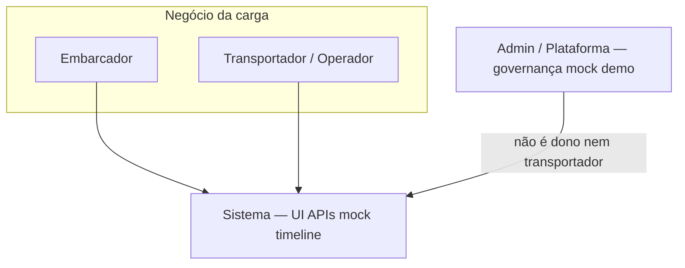
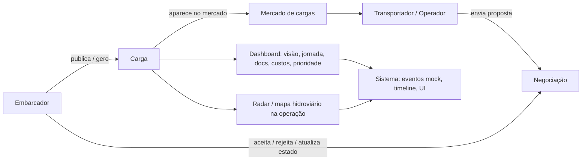
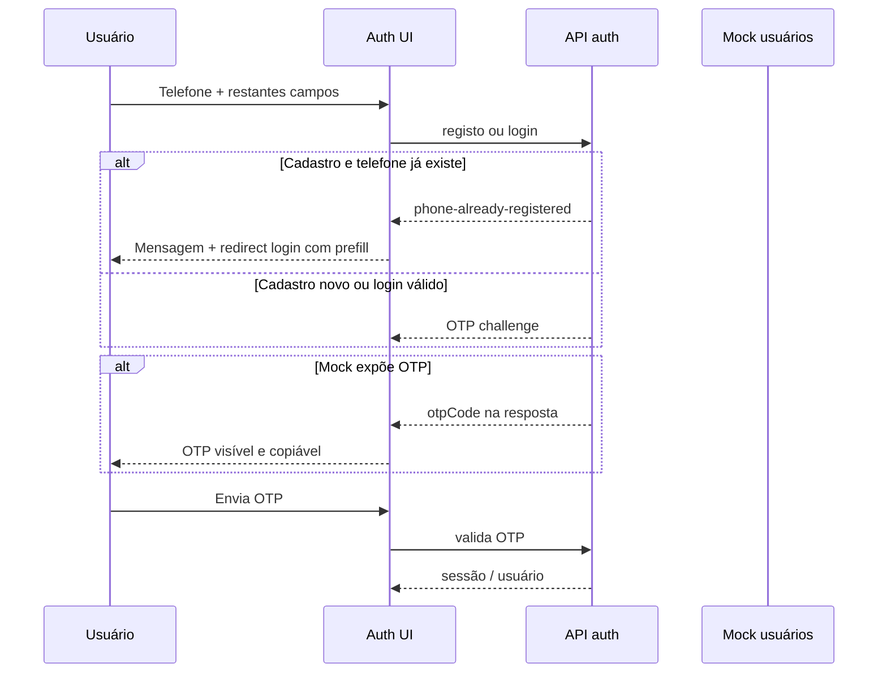
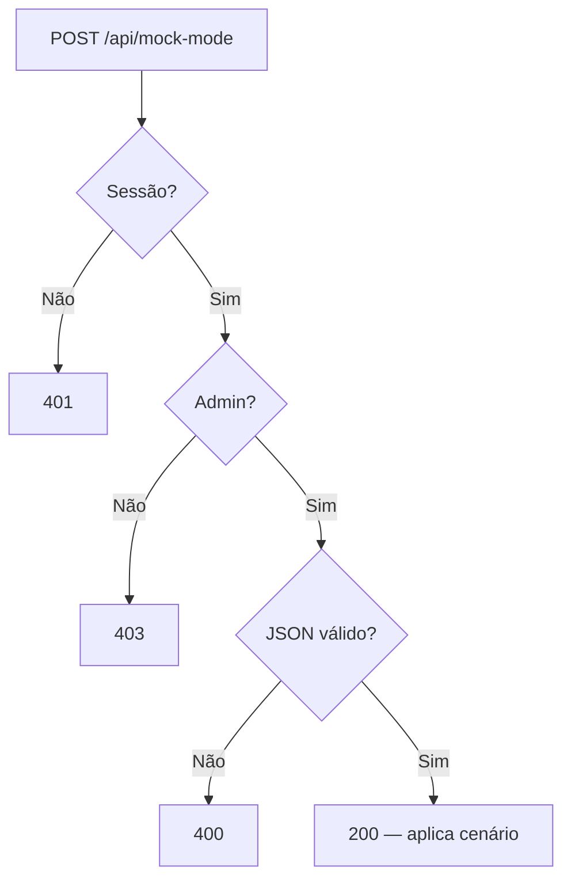
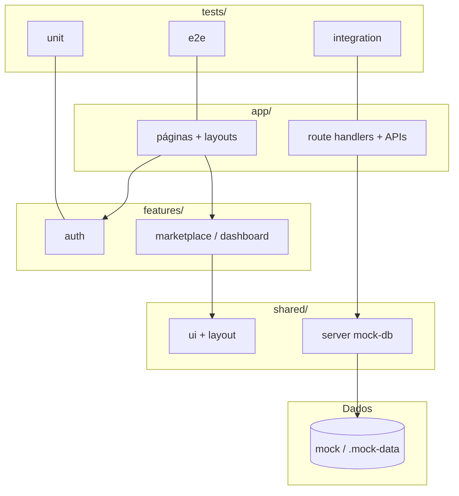
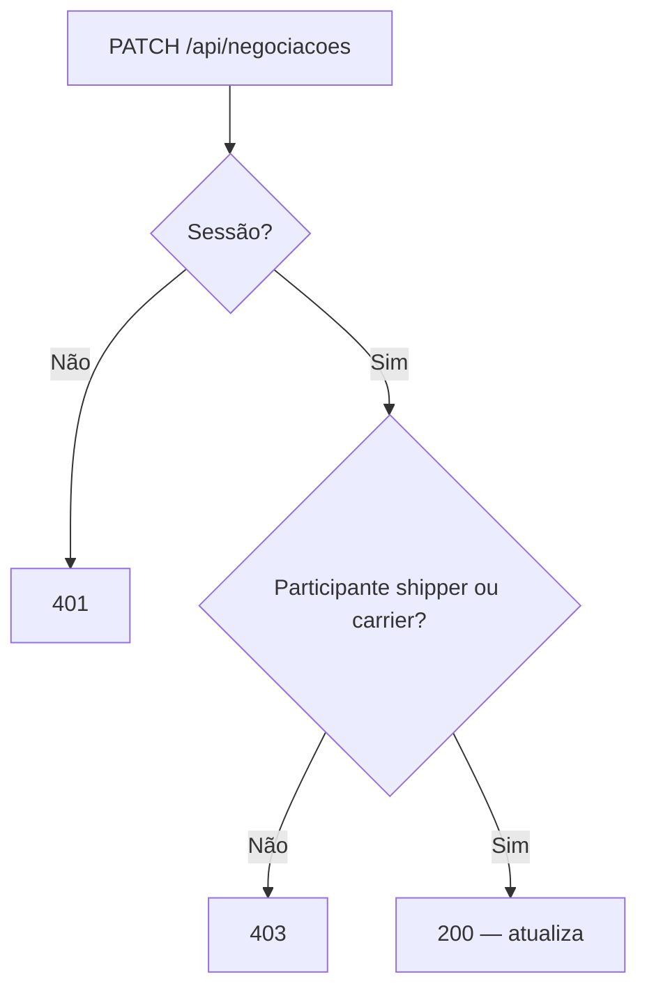
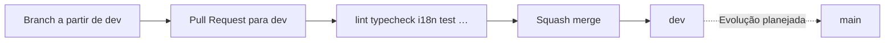

# HydroRivers — Deep Dive (versão real atualizada)

**Tipo:** narrativa de produto + contexto técnico — **documentação apenas** (não altera código).  
**Público:** portfólio, entrevista técnica, onboarding de dev, alinhamento com produto.  
**Tom:** honesto sobre **mock/dev**, **Em evolução** e **Evolução planejada**; nomes de negócio em português com identificadores técnicos quando necessário.

**Referência de stack (repo):** Next.js **16** (App Router), React **19**, TypeScript, Sass Modules, `next-intl` com **`pt-BR`**, **`en-US`**, **`es`**.

---

## 1. História do produto

**HydroRivers** é uma plataforma digital para **gestão e leitura inteligente de operações hidroviárias**. Ela existe para reduzir o custo de coordenação quando informação de carga, frota, negociação e acompanhamento vive espalhada entre planilhas, mensagens e memória individual.

No estado **atual do repositório**, a maior parte da persistência é **mock server-side** (JSON em desenvolvimento) — útil para demo, QA e evolução de produto **sem** afirmar que já existe ERP/TMS em produção.

---

## 2. Problema real

- **Informação tardia ou fragmentada** entre embarcador, transportador/operador e terminal.  
- **Dificuldade de priorizar** o que está em risco (documento, janela, corredor).  
- **Falta de um quadro único** que responda: *onde está a carga?*, *o que falta?*, *quanto pesa no custo?*, *como avança a jornada?*  
- **Operação em campo** (conectividade irregular) exige UI que não presuma só desktop.

O produto endereça estes pontos com **domínio explícito** (cargas, negociações, rastreio, impacto, etc.), **papéis** e **testes** — não como CRUD genérico.

---

## 3. Papéis de negócio

### 3.1 Embarcador

**Quem possui, publica ou gere a carga** (no código: `role: 'shipper'`).

Pode, **conforme implementação e permissões atuais** (nem tudo é paridade com transportador):

- criar ou acompanhar **cargas**;
- acompanhar **negociações** em que participa;
- usar o **dashboard operacional** (abas de visão geral, jornada, documentos, custos, prioridade) e o **radar / mapa de rastreio** onde exposto na UI;
- consultar **impacto** e rotas institucionais como **governo** (audiência de produto).

**Importante:** recursos visíveis dependem de **rota**, **papel** e **`approved`** — não assumir que todos os menus e ações são idênticos entre papéis.

### 3.2 Transportador / Operador

**Quem transporta, opera ou oferece capacidade logística** (no código: `role: 'carrier'`).

Pode, **onde a API e a UI permitem**:

- ver **oportunidades** no mercado de cargas;
- **criar proposta** de negociação (`POST /api/negociacoes` exige `carrier` aprovado no estado atual);
- acompanhar negociações e cargas ligadas à sua operação;
- utilizar as mesmas superfícies de **dashboard** / **rastreio** quando aplicável ao caso.

Política típica do MVP: transportador pode nascer **`approved: false`** até existir moderação explícita — ver `docs/SECURITY-PRODUCT-DECISIONS.md`.

---

## 4. Papéis de plataforma e governança (Admin / Plataforma)

**Admin / Plataforma** (`role: 'admin'`) **não** é o protagonista operacional da carga.

Serve para:

- **governança** e área administrativa na UI;
- **mock-mode** / cenários de demo e QA (`POST /api/mock-mode` apenas com sessão admin);
- **suporte, auditoria e segurança** como *função mental de produto* — sem misturar com “dono da carga” ou “transportador”.

**Negociação (código atual):** `PATCH /api/negociacoes` só permite alteração se o usuário for **`shipperId` ou `carrierId`** da negociação. O admin **não** entra como participante por omissão.

**Evolução planejada:** fluxo explícito “suporte/auditoria com permissão registrada” para alterar negociação — só quando existir rota + testes.

### 4.1 Diagrama — papéis no ecossistema



---

## 5. Fluxo principal da operação

Visão honesta do fluxo **implementado** no MVP demonstrável:



O **sistema** regista eventos e estados em **mock**; narrativa de impacto e documentos podem ser **demonstrativos** até integrações reais.

---

## 6. Auth, telefone único e OTP mock

### 6.1 Mock de usuários

Durante desenvolvimento, usuários cadastrados persistem na **camada mock** (ver APIs em `src/app/api/auth/*` e persistência em `.mock-data` / fluxo descrito em `docs/HYDRORIVERS-DEEP-DIVE.md`).

### 6.2 Telefone como identificador único

- A unicidade é verificada por **`phoneE164`** no registo.  
- Se o telefone já existe: API devolve `phone-already-registered`; a **UI** redireciona para **login** com `?prefill=` — **não** força novo cadastro completo só por repetir o número.

### 6.3 Campos obrigatórios

Login e cadastro mantêm **todos** os campos e validações (schemas Zod) — não são opcionais no MVP.

### 6.4 OTP mock (ambiente de desenvolvimento / demo)

- Em ambiente **não produção** (ou com `HYDRORIVERS_EXPOSE_OTP_CODE`), o servidor pode **expor** o código OTP na resposta.  
- A **UI** mostra o OTP num bloco **visível e copiável** — recurso **intencional para QA e demo**, não substitui canal seguro de produção.

**Em produção (conceito):** o código seria entregue por canal configurado (SMS, app autenticador, etc.) — **Evolução planejada** fora do âmbito mock atual.



---

## 7. Mock persistence e mock-mode

### 7.1 Persistência mock

Dados simulados alimentam mercado, negociações, rastreio e dashboard — **explícito para desenvolvimento**; não confundir com série oficial de custo/impacto.

### 7.2 Mock-mode (ferramenta dev / QA / demo)

Regras implementadas em `src/app/api/mock-mode/route.ts` (resumo):

| Situação | HTTP |
|----------|--------|
| Sem sessão | **401** |
| Usuário comum (não admin) | **403** |
| JSON inválido | **400** (sem reset / efeito colateral) |
| Admin válido + reset permitido | **200** |

**Não** é o fluxo operacional final de transporte.



---

## 8. Dashboard operacional

A experiência em torno da carga no **dashboard** (`OperationsBoard`, `src/features/dashboard/components/operations-board/`) organiza **abas** que reduzem custo cognitivo:

| Chave técnica | Função para o usuário |
|---------------|--------------------------|
| `overview` | **Visão geral** — estado, progresso, leitura rápida |
| `timeline` | **Jornada / timeline** — sequência da operação |
| `documents` | **Documentos** — o que falta ou importa no processo |
| `cost` | **Custos** — leitura demonstrativa no mock |
| `priority` | **Prioridade** — urgência e foco |

Além disso, existe a secção de **radar / mapa hidroviário** (ver §9) como leitura espacial da operação.

**Em evolução:** refinamentos de UX, mais ligação a dados reais quando o backend existir.

---

## 9. Radar hidroviário / tracking map

### 9.1 O que existe no código

- **`TrackingRoute`** e helpers em `hydro-route-tracking.helpers.ts` / `hydro-route-tracking.types.ts` — construção **determinística** da rota a partir da carga (`buildTrackingRoute`).  
- Componentes **`HydroRouteTrackingMapHeader`**, **`HydroRouteTrackingMapSvg`**, **`HydroRouteTrackingMapLegend`** (e composição em `hydro-route-tracking-map.tsx`), integrados no **`operations-board.tsx`**.  
- **SVG** operacional (path, progresso, POIs, estado da carga) — leitura de **origem**, **destino**, **progresso**, **corredor/hidrovia**, **status** e **posição ao longo da rota** (modelo mock).

### 9.2 O que não afirmar sem auditoria extra

- **`d3-geo`** está em `package.json`, mas **não** há `import` directo de `d3-geo` no `src/` na pesquisa rápida desta documentação — tratar projeções geo avançadas como **Evolução planejada** ou **Em evolução** até confirmar uso em runtime.  
- **WebSocket / polling** em tempo real para posição — **Evolução planejada** (não documentado como implementado aqui).

---

## 10. Mobile-native experience

Direcção **implementada em partes** do shell (`admin-chrome`, `BottomSheet`, `operations-board`):

- **Header** mais compacto em viewport móvel; **bottom navigation** para rotas principais.  
- **Avatar** e **sino** podem abrir **sheets** (conta / notificações).  
- **Filtros** e certos fluxos em **full-screen bottom sheet**.  
- **Sheets** com componente partilhado `BottomSheet` (snap points, `framer-motion` no ecossistema do projeto).  
- Ajustes de **scroll**, **safe-area** e rotas **auth** sem chrome completo — **Em evolução** contínua (ver `docs/HYDRORIVERS-DEEP-DIVE.md` e PRs recentes de shell móvel).

**Evolução planejada:** paridade total de todas as acções desktop↔mobile; testes E2E específicos de cada sheet no CI.

---

## 11. Arquitetura Next.js / React / App Router

- **`src/app/`** — rotas `page.tsx`, `layout.tsx`, **Route Handlers** (`app/api/.../route.ts`), **Server Actions** onde existirem.  
- **`src/features/`** — domínios (auth, marketplace, dashboard, tracking, …).  
- **`src/shared/`** — UI, layout, hooks, servidor (`mock-db`), routing, i18n helpers, QA, observabilidade, etc.  
- **`src/core/`** — i18n routing (`pt-BR`, `en-US`, `es`).  
- **Sass Modules** — estilo por componente.  
- **TypeScript strict** — contratos entre UI, domínio e API.



---

## 12. Feature-based architecture

Cada pasta em `features/` agrupa UI + domínio + serviços client quando aplicável — evita “Deus object” na raiz do `app/`. O `app/` compõe rotas e delega para features.

---

## 13. APIs, segurança e autorização

- **Autenticação:** cookie de sessão mock (`hydrorivers_session`).  
- **Autorização:** papel (`shipper` / `carrier` / `admin`), `approved`, participação em recurso (ex.: negociação).

**Negociação:**



Matriz detalhada: `docs/API-SECURITY-AUDIT.md`.

---

## 14. Testes

| Camada | Ferramenta | Exemplos reais |
|--------|------------|----------------|
| Unitário | Vitest | `tracking.helpers.test.ts`, `access-control.test.ts`, `auth-schemas.test.ts`, `mock-content.test.ts` |
| Integração | Vitest + handlers | `auth.register.post.test.ts` (telefone único), `auth.login.post.test.ts` (OTP), `mock-mode.post.test.ts`, `negociacoes.patch.test.ts` |
| E2E | Playwright | `auth.login.spec.ts`, `admin-mock-mode.spec.ts`, `locale.switch.spec.ts` |

**Evolução planejada:** E2E de cada bottom sheet no CI; cobertura mínima obrigatória por módulo (definir com o time).

---

## 15. CI/CD e quality gates

- **GitHub Actions:** `ci.yml` (push + PR: onboarding, `audit:docs`, lint, typecheck, `check:i18n`, `test`, `test:mock-mode`, **`build`**) e `pr-quality.yml` (PR: `verify` sem `build` no job).  
- **CD / deploy automático:** **Evolução planejada** — não descrito como pipeline fixa neste repo.

Comandos de validação **reais** (espelho local recomendado):

```bash
npm run lint
npm run typecheck
npm run check:i18n
npm run test
npm run build
```

(`npm run verify` agrega lint → typecheck → i18n → test → `test:mock-mode` — ver `package.json`.)

---

## 16. i18n

- Locales: **`pt-BR`**, **`en-US`**, **`es`**.  
- Arquivos: `messages/pt-BR.json`, `messages/en-US.json`, `messages/es.json`.  
- **`npm run check:i18n`:** usa **`pt-BR` como base** de chaves; falha com *Missing* / *Extra* nos outros — protege **paridade** e evita regressão em produto internacional.

---

## 17. Git flow

- **`main`** — estável / releases.  
- **`dev`** — **integração**; **PRs devem apontar para `dev`**.  
- **Branches:** `feat/...`, `fix/...`, `docs/...`, `test/...`, `refactor/...` (Conventional Branches).  
- **Merge:** **squash merge** preferencial.  
- **Commits:** [Conventional Commits](https://www.conventionalcommits.org/).

Exemplos de nomes:

- `feat/hydro-route-tracking-map`  
- `fix/mobile-native-dashboard-shell`  
- `docs/update-product-storytelling`  
- `test/add-auth-otp-flow-tests`



---

## 18. IA no SDLC

Ferramentas de IA (Cursor, etc.) como **assistentes de desenvolvimento** — política em `AGENTS.md`. **IA no produto** em runtime: **Evolução planejada** com gates de segurança (`docs/AI-ROADMAP.md`).

---

## 19. Roadmap realista

| Item | Estado |
|------|--------|
| Mock → Postgres / serviços reais | **Evolução planejada** |
| OTP por canal real (SMS/app) | **Evolução planejada** |
| WebSocket / posição ao vivo no mapa | **Evolução planejada** |
| Repository em todas as rotas | **Em evolução** (piloto em `GET /api/cargas` — ver `REPOSITORY-BOUNDARY.md`) |
| Paridade mobile/desktop completa | **Em evolução** |

---

## 20. Como apresentar no portfólio

**Versão curta (≈90 palavras):**  
HydroRivers é um front em **Next.js 16** e **React 19** para operações hidroviárias: mercado de cargas, negociações com regras por participante, dashboard com abas (visão, jornada, documentos, custos, prioridade) e **radar de rastreio** em SVG a partir de dados mock. Auth mock usa **telefone único**, OTP visível em demo, e **mock-mode** só para admin. Há **i18n** em três locales, **Vitest** + **Playwright**, e **GitHub Actions** com lint, types, i18n, testes e build. O honesto: é **MVP demonstrável**, não ERP — roadmap para backend real e canais seguros de OTP.

---

## 21. Como explicar em entrevista técnica

**Versão curta:**  
Arquitetura **App Router** + **features** + **shared**; APIs em **route handlers**; persistência **mock** com regras reais de autorização (ex.: `PATCH` negociações só para participantes). Telefone **E.164** único; fluxo de **OTP** com exposição controlada em dev. CI com **`ci.yml`** (inclui **`build`**) e **`pr-quality.yml`** (`verify`). Testes de integração em auth e negociações. Próximos passos: dados reais, endurecer GETs públicos (ver auditoria), E2E no CI.

---

## 22. O que é implementado, em evolução e futuro

| Área | Implementado | Em evolução | Evolução planejada |
|------|----------------|-------------|---------------------|
| Papéis embarcador / transportador / admin | ✓ (código + UX) | Refinar permissões por ecrã | Auditoria “agir em nome” |
| Auth mock + telefone único + OTP UI | ✓ | — | Canais reais de OTP |
| Mock-mode admin-only + 400 JSON | ✓ | — | — |
| Dashboard com abas + radar SVG | ✓ | Mobile shell / sheets | Dados ao vivo no mapa |
| `d3-geo` no bundle | Depende de uso | Confirmar imports no mapa | Projeções cartográficas plenas |
| WebSocket mapa | — | — | ✓ |
| Repositório em todas as APIs | Parcial | ✓ | DB real |
| CD automático | — | — | ✓ |
| E2E no CI | — | — | ✓ |

---

## Termos legados substituídos

| Legado | Atual |
|--------|--------|
| Shipper / carrier como copy de produto | **Embarcador** / **Transportador–Operador** (+ `shipper` / `carrier` técnico) |
| Admin como “terceiro personagem” operacional | **Admin / Plataforma** (governança, mock-mode) |
| `en` | **`en-US`** (URLs e arquivos) |
| “Sistema já é produção” | **Mock/dev** explícito |

---

## Afirmações antigas que viram «Evolução planejada»

- Integração fiscal/documental **real** com órgãos externos.  
- Cálculo de frete **oficial** em produção.  
- Posição da frota **em tempo real** (WebSocket/polling).  
- **Deploy** contínuo documentado como pipeline única.  
- **Admin** altera negociação no dia a dia sem fluxo explícito.

---

## Pontos a auditar no código antes de afirmar em voz alta

- Uso efetivo de **`d3-geo`** nos componentes do mapa (hoje: dependência presente; imports a confirmar).  
- Lista exacta de **acções** por papel em **cada** rota (matriz `API-SECURITY-AUDIT.md`).  
- Cobertura **E2E** por fluxo (sheets, radar fullscreen, etc.).  
- Campos de **custos/documentos** no dashboard: até que ponto são **mock** vs cálculo real.

---

## Versão curta para não técnicos

**HydroRivers** é uma aplicação web que ajuda quem **move carga por água** a ver no mesmo sítio o estado da carga, propostas, documentos e o “mapa mental” do trajeto — em vez de planilhas soltas. Ainda usa **dados de demonstração**, mas já mostra **regras de negócio** (quem pode negociar, quem é admin de plataforma, telefone como identificação no teste). O próximo passo natural é ligar a **dados reais** e canais oficiais de confirmação (OTP por telemóvel, etc.).

---

## Referência ao storytelling anterior

O arquivo histórico `docs/product/hydririvers-storytelling-overview.md` mantém narrativa útil de tom literário; este documento **substitui-o como referência de “estado atual”** para entrevista e produto. Recomenda-se ler **este** arquivo primeiro e o **Deep Dive técnico** (`docs/HYDRORIVERS-DEEP-DIVE.md`) para detalhe de CI, testes e Git.
