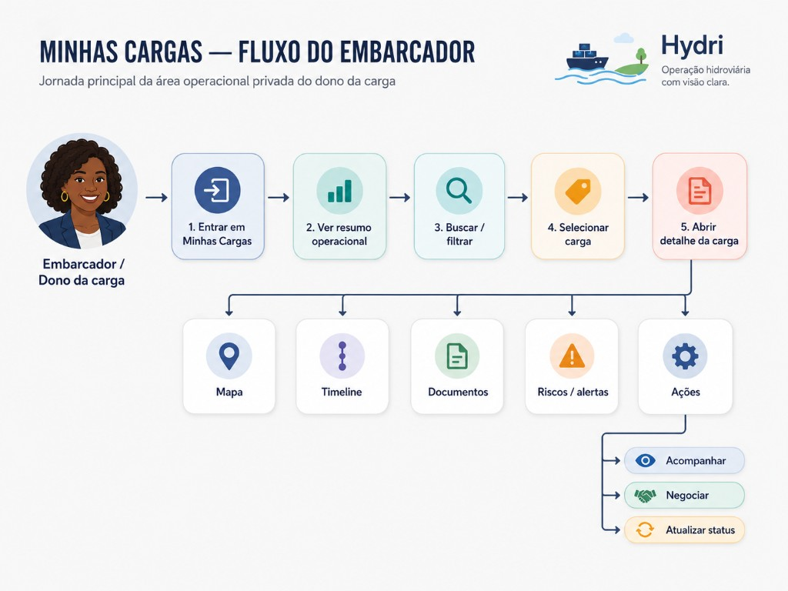

# Minhas Cargas — Fluxo do Embarcador

| Metadado | Valor |
|----------|-------|
| **Padrão visual** | [Hydri Persona Flow Diagram](../../design/hydri-persona-flow-diagram.md) |
| **Status** | Fluxo aprovado — implementação mobile premium Fases A–G concluída (2026-06-12) |
| **Persona** | Embarcador / dono da carga (`shipper`) |
| **Rota** | `/[locale]/minhas-cargas` |
| **Imagem** | [`./minhas-cargas-fluxo-embarcador.png`](./minhas-cargas-fluxo-embarcador.png) |

---

## 1. Rota

`/[locale]/minhas-cargas`

Detalhe privado: `/[locale]/minhas-cargas/[id]`

Requer sessão autenticada. Admin é redirecionado para área administrativa. Visitante é redirecionado para login com retorno à rota.

---

## 2. Persona

**Embarcador / dono da carga** — usuário que publica, acompanha e opera suas cargas na área privada. No diagrama aprovado, representado à esquerda como pessoa negra, conforme regra do padrão `Hydri Persona Flow Diagram`.

Transportador (`carrier`) também acessa `/minhas-cargas` com copy e carteira adaptadas; este fluxo documenta o caminho **primário do embarcador**.

---

## 3. Objetivo da rota

Responder: **“Quais cargas pertencem a mim e como continuo a operação?”**

A rota é a **área operacional privada** do embarcador — não marketplace, não cockpit agregado do dashboard. O usuário entra para ver resumo da carteira, localizar uma carga, abrir detalhe e agir (acompanhar, negociar, atualizar status, documentos, alertas).

---

## 4. Valor gerado

| Para o embarcador | Para o produto |
|-------------------|----------------|
| Visão consolidada das próprias cargas sem ruído do marketplace público | Separação clara entre vitrine (`/cargas`) e carteira privada |
| Resumo operacional antes da lista (ativas, pendências, propostas) | Reduz confusão entre dados públicos e `owner` |
| Caminho direto para detalhe com mapa, timeline, documentos e ações | Base para priorizar gaps de implementação com arte aprovada |
| CTAs operacionais no detalhe (acompanhar, negociar, status) | Alinha engenharia ao fluxo de decisão já validado em produto |

---

## 5. Fluxo aprovado em texto

### Fluxo principal (horizontal)

| # | Etapa | Intenção |
|---|-------|----------|
| 1 | **Entrar em Minhas Cargas** | Acesso à área privada via navegação autenticada |
| 2 | **Ver resumo operacional** | KPIs/resumo da carteira antes ou junto da lista |
| 3 | **Buscar / filtrar** | Encontrar carga específica na carteira |
| 4 | **Selecionar carga** | Escolher item na lista |
| 5 | **Abrir detalhe da carga** | Visão completa da carga selecionada |

### Branches inferiores (a partir do detalhe)

| Seção | Propósito |
|-------|-----------|
| **Ver mapa** | Posição e contexto geográfico da operação |
| **Ver timeline** | Jornada e marcos da carga |
| **Ver documentos** | Readiness e pendências documentais |
| **Ver riscos / alertas** | Exposição de riscos e alertas operacionais |
| **Executar ações** | CTAs operacionais do detalhe (ver seção 6) |

---

## 6. Ações

Ações operacionais previstas no fluxo aprovado, a partir do detalhe da carga:

| Ação | Propósito |
|------|-----------|
| **Acompanhar** | Seguir evolução da operação (status, marcos, próximo passo) |
| **Negociar** | Entrar ou retomar negociação vinculada à carga |
| **Atualizar status** | Registrar ou corrigir status operacional conforme permissões do embarcador |

---

## 7. Imagem do fluxo aprovado

Arte visual aprovada versionada no repositório:

| Campo | Valor |
|-------|-------|
| **Referência relativa** | `./minhas-cargas-fluxo-embarcador.png` |
| **Caminho no repositório** | `docs/product/flows/minhas-cargas-fluxo-embarcador.png` |
| **Padrão** | [Hydri Persona Flow Diagram](../../design/hydri-persona-flow-diagram.md) |

Não recriar a arte — alterações visuais exigem nova rodada de aprovação de produto.

---

## 8. Componentes envolvidos

Implementação atual (Fases A–F entregues — 2026-06-12):

| Camada | Componente / módulo | Papel no fluxo |
|--------|---------------------|----------------|
| Layout | `minhas-cargas/layout.tsx` → `MinhasCargasAuthGate` | Gate client: skeleton neutro até sessão; redirect login com `next` |
| Página | `minhas-cargas/page.tsx` | Entrada RSC, auth redirect HTTP, fetch de carteira |
| Página | `minhas-cargas/[id]/page.tsx` | Detalhe privado com ownership + `OwnedCargoDetail` |
| Loading | `minhas-cargas/loading.tsx`, `owned-cargo-detail-skeleton` | Skeleton lista e detalhe |
| Lista | `MyCargoesList` | Resumo operacional 2×2, seção de cards, empty state |
| Resumo | `owned-cargo-summary` | KPIs compactos da carteira |
| Card | `owned-cargo-card` | Card privado premium (~40–50% altura do marketplace) |
| Detalhe | `owned-cargo-detail` | Cockpit: header, status 1×1, resumo, grid 2×2, support cards, ações |
| Preview | `owned-cargo-preview-grid` + `owned-cargo-preview-card` | Portas Mapa/Timeline/Documentos/Riscos |
| Sheets | `owned-cargo-*-sheet` (map, timeline, documents, risks) | Profundidade via BottomSheet global |
| Panel URL | `owned-cargo-panel-search-params`, `use-owned-cargo-panel` | `?panel=map\|timeline\|documents\|risks` |
| Shell | `PageShell`, `Breadcrumb` | Estrutura e navegação |
| Serviço | `getMyCargoesForUser`, `getMyCargoByIdForUser` | Dados da carteira privada (ID normalizado) |
| Domínio | `cargo-visibility-policy.ts`, `derive-owned-cargo-detail` | Tier `owner`; previews operacionais |

---

## 9. Mocks envolvidos

| Mock / fonte | Caminho | Uso |
|--------------|---------|-----|
| Carteira privada (owned) | `src/features/cargo/mocks/owned-cargos.mock.ts` | Massa por `shipperId` / `ownerId` / carrier vinculado |
| Serviço | `src/features/cargo/services/cargo.service.ts` | `getMyCargoesForUser()` agrega mocks owned por persona |
| Legado / fallback | `src/features/my-cargos/mocks/myCargos.mock.ts` | Referência histórica; convergir com `owned-cargos` |
| Visibilidade | `src/features/cargo/domain/cargo-visibility-policy.ts` | Gate `owner` — não expor carteira em `/cargas` |

Regra de negócio: ver [`docs/business-rules.md`](../../business-rules.md) — seção *Cargas por navegação* e *Regras de visibilidade*.

---

## 10. Diferença para `/cargas`

| Aspecto | `/[locale]/cargas` | `/[locale]/minhas-cargas` |
|---------|-------------------|---------------------------|
| **Pergunta** | Quais cargas estão disponíveis no marketplace? | Quais cargas são minhas? |
| **Público** | Visitante e autenticado (vitrine) | Usuário logado (carteira privada) |
| **Dados** | `getPublicCargos()` / `publicCargosMock` | `getMyCargoesForUser()` / `owned-cargos.mock` |
| **Visibilidade** | Tier `public` | Tier `owner` (ownership obrigatório) |
| **Detalhe** | `/cargas/[id]` — oferta pública, dados sensíveis limitados | `/minhas-cargas/[id]` — cockpit operacional (`owned-cargo-detail`) |
| **Mapa/Timeline/Docs/Riscos** | Inline ou rotas públicas | Preview 2×2 no cockpit + BottomSheet (`?panel=`) |
| **Card lista** | `CargoCard` marketplace | `owned-cargo-card` compacto premium |
| **Ações** | Buscar oferta, abrir, negociar entrada | Acompanhar, documentos, timeline, status, negociação vinculada |
| **O que evitar** | Listar carteira privada como se fosse marketplace | Misturar cargas públicas na lista principal |

Decisão de produto: [`docs/product/dashboard-cargas-minhas-cargas-decision.md`](../dashboard-cargas-minhas-cargas-decision.md).

---

## 11. Próximos passos

**Entregue (Fases A–G — 2026-06-12):**

- ✅ Lista premium com `owned-cargo-card` e resumo 2×2
- ✅ Detalhe cockpit com grid 2×2 (Mapa, Timeline, Documentos, Riscos)
- ✅ Sheets via BottomSheet global + `?panel=` na URL
- ✅ Auth gate client (`MinhasCargasAuthGate`) + redirect com `next`
- ✅ QA visual 3 devices (360×740, 390×844, 430×932)

**Pós-PR (backlog):**

1. **Buscar / filtrar avançado** — validar se filtros de `MyCargoesList` cobrem busca, status e pendências como no diagrama completo.
2. **BottomNav active tab** — mapear `/minhas-cargas` para tab correta (issue separada).
3. **Ghosting header** — mitigar texto fantasma no chrome mobile compartilhado.
4. **Mocks por persona** — massa rica para `u-shipper-*` em cenários empty/error raros.
5. **Ações do detalhe** — evoluir **Negociar** e **Atualizar status** conforme `access-control` quando API real existir.

Critérios de aceite ampliados: [`docs/product/mobile-shipper-use-cases.md`](../mobile-shipper-use-cases.md).

---

## Fluxo técnico complementar

A jornada de produto acima é complementada pelo **fluxo técnico aprovado** (auth, loading, serviço, mocks, estados, erros):

- **Documento:** [`minhas-cargas-fluxo-tecnico-embarcador.md`](./minhas-cargas-fluxo-tecnico-embarcador.md)
- **Imagem:** [`./minhas-cargas-fluxo-tecnico-embarcador.png`](./minhas-cargas-fluxo-tecnico-embarcador.png)

| Imagem | Papel |
|--------|-------|
| `minhas-cargas-fluxo-embarcador.png` | Jornada da persona |
| `minhas-cargas-fluxo-tecnico-embarcador.png` | Fluxo técnico / estados / mocks / policy |

Ambas são fonte documental aprovada para tarefas futuras em `/minhas-cargas`.

---

## Documentos relacionados

- [Minhas Cargas — Fluxo Técnico do Embarcador](./minhas-cargas-fluxo-tecnico-embarcador.md)
- [Hydri Persona Flow Diagram](../../design/hydri-persona-flow-diagram.md)
- [Decisão Dashboard / Cargas / Minhas cargas](../dashboard-cargas-minhas-cargas-decision.md)
- [Casos de uso mobile embarcador](../mobile-shipper-use-cases.md)
- [Regras de negócio](../../business-rules.md)
