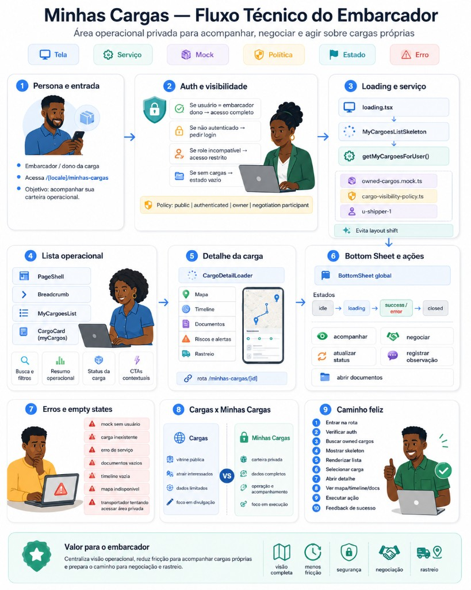

# Minhas Cargas — Fluxo Técnico do Embarcador

| Metadado | Valor |
|----------|-------|
| **Tipo** | Hydri Persona Flow Diagram — fluxo técnico |
| **Padrão visual** | [Hydri Persona Flow Diagram](../../design/hydri-persona-flow-diagram.md) |
| **Status** | Fluxo técnico aprovado — alinhado à implementação Fases A–G (2026-06-12) |
| **Persona** | Embarcador / dono da carga |
| **Rota** | `/[locale]/minhas-cargas` |
| **Imagem** | [`./minhas-cargas-fluxo-tecnico-embarcador.png`](./minhas-cargas-fluxo-tecnico-embarcador.png) |

---

## Objetivo

Documentar o caminho técnico da rota privada operacional do embarcador:

**entrada → auth/policy → loading → mock service → lista → detalhe → BottomSheet/ações → erros/empty states → caminho feliz.**

Complementa a jornada de produto em [`minhas-cargas-fluxo-embarcador.md`](./minhas-cargas-fluxo-embarcador.md) com estados, serviços, mocks, políticas e componentes envolvidos.

---

## Imagem do fluxo técnico aprovado

| Campo | Valor |
|-------|-------|
| **Referência relativa** | `./minhas-cargas-fluxo-tecnico-embarcador.png` |
| **Caminho no repositório** | `docs/product/flows/minhas-cargas-fluxo-tecnico-embarcador.png` |

Não recriar a arte — alterações visuais exigem nova rodada de aprovação de produto.

### Diferença entre imagem de persona e imagem técnica

| Arquivo | Papel |
|---------|-------|
| [`minhas-cargas-fluxo-embarcador.png`](./minhas-cargas-fluxo-embarcador.png) | Jornada da persona — etapas, valor e branches de produto |
| [`minhas-cargas-fluxo-tecnico-embarcador.png`](./minhas-cargas-fluxo-tecnico-embarcador.png) | Fluxo técnico — estados, mocks, policy, serviços e componentes |

Ambas são **fonte documental aprovada** para futuras tarefas que toquem `/minhas-cargas` ou componentes relacionados.

---

## Blocos documentados

### 1. Persona e entrada

- **Persona:** Embarcador / dono da carga.
- **Entrada:** rota `/[locale]/minhas-cargas`.
- **Objetivo:** monitorar a carteira operacional privada.

### 2. Auth e visibilidade

- Gate por sessão mock e tier de visibilidade.
- **Layout client:** `MinhasCargasAuthGate` em `minhas-cargas/layout.tsx` — skeleton neutro até `useAuthSession` resolver; redirect client para login com `next` quando não autenticado (evita flash de conteúdo privado).
- **Gate RSC:** páginas redirecionam via `getSessionUser()` + `redirect(appRoutes.auth.login(..., nextPath))`.
- **Policy:** `public | authenticated | owner | negotiation participant` (`cargo-visibility-policy.ts`).
- Branches de acesso documentados na seção [Branches IF/ELSE](#branches-ifelse).

### 3. Loading e serviço

- **Tela:** `loading.tsx` → `MyCargoesListSkeleton`.
- **Serviço:** `getMyCargoesForUser()`.
- **Mocks/policy:** `owned-cargos.mock.ts`, `cargo-visibility-policy.ts`, usuário mock `u-shipper-1`.
- **Estado:** evita layout shift durante fetch.

### 4. Lista operacional

- **Componentes:** `PageShell`, `Breadcrumb`, `MyCargoesList`, `owned-cargo-summary`, `owned-cargo-card`.
- **Features:** busca e filtros, resumo operacional 2×2, status da carga, tap no card → detalhe.

### 5. Detalhe da carga (cockpit)

- **Componente:** `owned-cargo-detail` (substitui `CargoDetailLoader` nesta rota).
- **Rota:** `/[locale]/minhas-cargas/[id]`.
- **Lookup:** `getMyCargoByIdForUser(id, userId, role)` com `normalizeCargoIdForLookup` — card e detalhe usam o mesmo ID canônico.
- **Blocos:** status card 1×1, resumo operacional, preview grid 2×2 (mapa, timeline, documentos, riscos), support cards, ações primárias.

### 6. BottomSheet, panel URL e ações

- **Componente:** BottomSheet global (`src/shared/components/bottom-sheet`).
- **Panel param:** `?panel=map|timeline|documents|risks` — `owned-cargo-panel-search-params.ts`, hook `use-owned-cargo-panel`.
- **Comportamento:** click no preview → `router.replace` com `panel`; close/back remove param; param inválido é descartado preservando demais query params.
- **Sheets:** `owned-cargo-map-sheet`, `owned-cargo-timeline-sheet`, `owned-cargo-documents-sheet`, `owned-cargo-risks-sheet`.
- **Ações:** acompanhar, negociar, atualizar status (CTAs no cockpit; sheets para profundidade).

### 7. Erros e empty states

- Mock sem usuário.
- Carga inexistente.
- Erro de serviço.
- Documentos ou timeline vazios.
- Mapa indisponível.
- Transportador tentando acessar área privada do embarcador.

### 8. Cargas x Minhas Cargas

| Aspecto | `/cargas` (público) | `/minhas-cargas` (privado) |
|---------|---------------------|----------------------------|
| **Propósito** | Vitrine — atrair interesse | Carteira operacional do dono |
| **Dados** | Limitados, foco em divulgação | Completos, foco em operação |
| **Execução** | Descoberta e entrada | Acompanhamento, negociação, status |

### 9. Caminho feliz

Ver seção [Caminho feliz](#caminho-feliz) abaixo.

### 10. Valor para o embarcador

- Centraliza visão operacional da carteira.
- Reduz fricção para acompanhar cargas próprias.
- Prepara caminho para negociação e rastreio.
- Benefícios: visão completa, menos fricção, segurança, negociação, rastreio.

---

## Caminho feliz

1. Entrar em `/minhas-cargas`.
2. `MinhasCargasAuthGate` aguarda sessão (skeleton) ou redirect login com `next`.
3. RSC verifica auth; buscar owned cargos (`getMyCargoesForUser()`).
4. Renderizar skeleton (`loading.tsx` / `MyCargoesListSkeleton`).
5. Renderizar lista (`MyCargoesList` + `owned-cargo-card`).
6. Selecionar carga (tap no card).
7. Abrir detalhe (`owned-cargo-detail` em `/minhas-cargas/[id]`).
8. Ver previews Mapa, Timeline, Documentos, Riscos no grid 2×2.
9. Tap preview → BottomSheet abre; URL ganha `?panel=`.
10. Fechar sheet (close/back) → remove `panel`; permanece no detalhe.
11. Executar ação operacional no cockpit quando aplicável.

---

## Branches IF/ELSE

| Condição | Resultado |
|----------|-----------|
| **IF** usuário é embarcador dono **THEN** | Acesso completo à carteira e detalhe |
| **ELSE IF** usuário não autenticado **THEN** | Pedir login com retorno à rota |
| **ELSE IF** role incompatível **THEN** | Acesso restrito (ex.: admin redirecionado; transportador com copy adaptada) |
| **ELSE IF** sem cargas **THEN** | Estado vazio na lista |
| **ELSE IF** carga inexistente **THEN** | Erro / not found no detalhe |
| **ELSE** | Renderizar lista operacional |

---

## Mocks envolvidos

| Mock / módulo | Caminho | Uso |
|---------------|---------|-----|
| Carteira owned | `src/features/cargo/mocks/owned-cargos.mock.ts` | Massa por `shipperId` / `ownerId` |
| Vitrine pública (contraste) | `src/features/cargo/mocks/publicCargos.mock.ts` | Referência tier `public` — não misturar na lista privada |
| Shim legado | `src/features/my-cargos/mocks/myCargos.mock.ts` | Reexporta `owned-cargos` quando ainda existir |
| Policy | `src/features/cargo/domain/cargo-visibility-policy.ts` | Tiers `public`, `authenticated`, `owner` |
| Usuário mock | `u-shipper-1` | Persona embarcador para QA do fluxo |
| Serviço | `src/features/cargo/services/cargo.service.ts` | `getMyCargoesForUser()`, `getMyCargoByIdForUser()` |
| Timeline / documentos / riscos / mapa | checkpoints do domínio cargo | Quando existirem no detalhe privado |

---

## Componentes envolvidos

| Camada | Componente / módulo | Papel |
|--------|---------------------|-------|
| Auth gate | `MinhasCargasAuthGate` | Skeleton + redirect client com `next` |
| Shell | `PageShell`, `Breadcrumb` | Estrutura e navegação |
| Lista | `MyCargoesList`, `owned-cargo-summary` | Resumo, grid, empty state |
| Loading | `MyCargoesListSkeleton`, `OwnedCargoDetailSkeleton` | Skeleton lista e detalhe |
| Card | `owned-cargo-card` | Seleção na lista |
| Detalhe | `owned-cargo-detail`, `owned-cargo-detail-header`, `owned-cargo-detail-summary` | Cockpit operacional |
| Preview | `owned-cargo-preview-grid`, `owned-cargo-preview-card` | Portas para sheets |
| Sheets | `owned-cargo-*-sheet` | Mapa, timeline, documentos, riscos |
| Panel | `owned-cargo-panel-search-params`, `use-owned-cargo-panel` | Estado URL `?panel=` |
| BottomSheet | BottomSheet global (shared) | Container de sheets |
| Serviço | `cargo.service.ts` | `getMyCargoesForUser`, `getMyCargoByIdForUser` + normalização ID |
| Domínio | `derive-owned-cargo-detail`, `cargo-visibility-policy` | Previews e tiers |

---

## Documentos relacionados

- [Minhas Cargas — Fluxo do Embarcador (persona)](./minhas-cargas-fluxo-embarcador.md)
- [Hydri Persona Flow Diagram](../../design/hydri-persona-flow-diagram.md)
- [Regras de negócio](../../business-rules.md)
- [Feature scope audit](../../feature-scope-audit.md)
