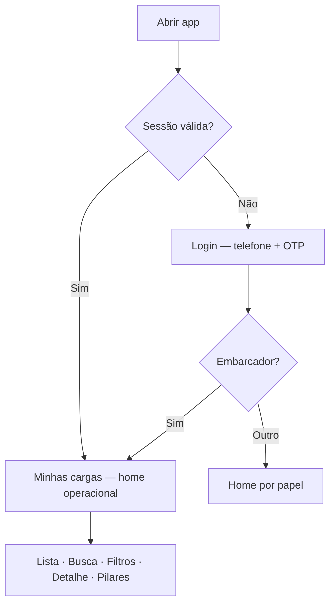

# HydriRivers — Bússola de Produto: Embarcador Mobile

| Metadado | Valor |
|----------|-------|
| **Status** | **Fonte de verdade de produto (estado desejado)** — fluxo e casos de uso do Embarcador mobile |
| **Escopo** | Casos de uso, fluxo de negócio, informação por tela, contrato de dados, priorização, DS — **somente documentação** |
| **Usuário foco** | Embarcador (`shipper`) em dispositivo mobile |
| **Contexto técnico auditado** | [`hydririvers-business-flow-blueprint.md`](./hydririvers-business-flow-blueprint.md) (as-is do repo em 2026-06-01) |
| **Precede implementação** | O que está aqui **define o alvo**; código, mocks e telas lab convergem para este doc — não o contrário |

---

## 0. Charter: produto desejado vs. implementação atual

### O que este documento é

Este arquivo define **como o fluxo mobile do Embarcador deve funcionar** para entregar valor operacional: encontrar cargas, entender status, filtrar, abrir detalhe, acompanhar jornada, consultar documentos e custos, e agir com clareza.

Ele responde: *o que construir, refinar ou remover* — não *o que o repositório já faz*.

### O que este documento não é

- **Não** é um espelho do código atual.
- **Não** limita decisões ao que existe em `dev-v2`, `/minhas-cargas` ou mocks parciais.
- **Não** substitui o blueprint técnico — esse documento descreve o **as-is** auditado.

### Relação com o Business Flow Blueprint

| Documento | Papel | Quando consultar |
|-----------|-------|------------------|
| **Este doc** (`mobile-shipper-use-cases.md`) | **To-be** — bússola de produto Embarcador mobile | PRs de tela, mocks, priorização, aceite |
| [`hydririvers-business-flow-blueprint.md`](./hydririvers-business-flow-blueprint.md) | **As-is** — rotas, mocks, gaps, lab `dev-v2`, riscos de regressão | Implementação, QA, diff repo vs. alvo |
| DS oficial | Aparência e componentes | Visual e interação |

**Regra:** divergência entre este doc e o repo é **esperada** durante a evolução. A implementação deve **fechar o gap**; o produto **não** deve ser rebaixado para o que o lab já mostra.

O mapa de gaps (lab, produção, mocks) está no [Apêndice A](#apêndice-a-gaps-de-implementação-vs-estado-desejado) — fora do corpo normativo dos casos de uso.

### Legenda de status (decisões de produto)

| Tag | Significado |
|-----|-------------|
| **Decidido** | Regra de produto que o time deve seguir ao implementar |
| **Proposto** | Direção forte; detalhe fino ou política ainda em refinamento |
| **Futuro** | Fora do escopo do MVP mobile embarcador; não bloqueia o núcleo |
| **Risco** | Cuidado em PR (regressão, mistura de escopos) |
| **Precisa validar** | Dependência de negócio, jurídico ou piloto em campo |

*Tags de implementação (**Atual**, **Parcial**, **Laboratório**) pertencem ao blueprint e ao Apêndice A — não redefinem necessidade de produto.*

---

## Índice

0. [Charter](#0-charter-produto-desejado-vs-implementação-atual)
1. [Decisão principal](#1-decisão-principal)
2. [Princípios de produto](#2-princípios-de-produto)
3. [Persona: Embarcador mobile](#3-persona-embarcador-mobile)
4. [Jobs to be Done](#4-jobs-to-be-done)
5. [Casos de uso principais](#5-casos-de-uso-principais)
6. [Fluxo de navegação mobile](#6-fluxo-de-navegação-mobile)
7. [Informação por tela](#7-informação-por-tela)
8. [Mock / data contract](#8-mock--data-contract)
9. [Matriz de decisão](#9-matriz-de-decisão)
10. [Regras de priorização](#10-regras-de-priorização)
11. [Microcopy](#11-microcopy)
12. [Design guidance (DS)](#12-design-guidance-baseado-no-ds)
13. [Regressão e segurança](#13-regressão-e-segurança)
14. [Próximas decisões a bater martelo](#14-próximas-decisões-a-bater-martelo)
15. [Critérios de aceite do fluxo](#15-critérios-de-aceite-do-fluxo-embarcador-mobile)
- [Apêndice A: Gaps de implementação](#apêndice-a-gaps-de-implementação-vs-estado-desejado)

---

## 1. Decisão principal

| Item | Conteúdo | Status |
|------|----------|--------|
| **Usuário foco** | Embarcador no mobile (`shipper`) | **Decidido** |
| **Produto nesta etapa** | Acompanhamento e gestão operacional das **cargas do embarcador** — não marketplace como home, não cockpit desktop como substituto da lista | **Decidido** |
| **Superfície primária** | Mobile-first (375–390px); bottom nav + bottom sheet + páginas só quando o conteúdo exigir | **Decidido** |
| **Home operacional pós-login** | `/[locale]/minhas-cargas` — lista privada do embarcador | **Decidido** |
| **Fonte de dados da lista** | Apenas cargas com `shipperId` / `ownerUserId` do usuário logado | **Decidido** |
| **Marketplace** | `/cargas` permanece vitrine pública; acesso secundário (buscar transporte), nunca confundido com “minhas operações” | **Decidido** |
| **Dashboard** | Visão agregada “o que exige ação”; **não** substitui a lista no mobile MVP | **Decidido** |

### Fluxo nuclear (bússola)

```
Entrar → Ver minhas cargas → Buscar/filtrar → Abrir detalhe → Entender situação
      → Acompanhar jornada → Consultar documentos/custos → Tomar ação
```

Cada etapa responde a uma pergunta operacional:

| Etapa | Pergunta do embarcador |
|-------|------------------------|
| Entrar | “Estou no app certo, como embarcador?” |
| Ver minhas cargas | “O que está comigo agora?” |
| Buscar/filtrar | “Qual carga procuro neste recorte?” |
| Abrir detalhe | “Esta é a carga certa?” |
| Entender situação | “Qual status, ETA, rota e o que falta?” |
| Acompanhar jornada | “O que já aconteceu e qual o próximo marco?” |
| Documentos/custos | “Posso prestar contas e fechar financeiramente?” |
| Tomar ação | “O que faço agora?” (completar doc, ver proposta, rastrear) |

**Por que este fluxo valida o núcleo de valor:** o embarcador cria e sustenta demanda; sem lista confiável + detalhe explicativo + pilares de confiança (jornada, documentos, custos), transportador e operador não têm base para evoluir depois.

---

## 2. Princípios de produto

| # | Princípio | Implicação prática | Status |
|---|-----------|-------------------|--------|
| P1 | **Mobile-first** | Bottom nav, sheets, touch targets, safe-area; não comprimir desktop | **Decidido** |
| P2 | **Informação crítica primeiro** | Status, rota, ETA e ação acima de gráficos e mapas decorativos | **Decidido** |
| P3 | **Card = resposta em 5 perguntas** | O que é · onde está · qual status · quando chega · exige ação? | **Decidido** |
| P4 | **Reduzir ansiedade operacional** | Próximo passo em linguagem humana em toda carga ativa; badges semânticos; sem jargão de software | **Decidido** |
| P5 | **Filtros encurtam caminho** | Poucos grupos de alto valor; limpar em 1 toque; empty state claro | **Decidido** |
| P6 | **Detalhe sem labirinto** | Resumo + rota + ETA + atalhos de jornada, documentos e custos no primeiro plano (≤1 scroll até ações) | **Decidido** |
| P7 | **Jornada, documentos e custos = confiança** | Mesmo como placeholder útil no MVP, nunca esconder que existem | **Decidido** |
| P8 | **DS orienta aparência; casos de uso orientam prioridade** | Não implementar gráfico/mapas só porque existem no Figma | **Decidido** |
| P9 | **Separação marketplace vs minhas cargas** | Embarcador não confunde oportunidade pública com operação própria | **Decidido** |
| P10 | **Mocks determinísticos** | Sem PII real; dados fictícios estáveis para testes e QA | **Decidido** (`AGENTS.md`) |

---

## 3. Persona: Embarcador mobile

### Quem é

| Dimensão | Descrição | Status |
|----------|-----------|--------|
| Papel | `shipper` — dono da carga, publicador, responsável por documentação e contratação | **Decidido** |
| Organização | Cooperativa, indústria, trading, operador logístico contratante | **Proposto** (personas QA: `u-shipper-1` em mocks) |
| Literacia digital | Média — usa WhatsApp no dia a dia; app deve ser óbvio | **Proposto** |
| Conectividade | Intermitente em terminal/porto; priorizar texto e estados offline-friendly no futuro | **Futuro** |

### O que tenta fazer

- Saber **quais cargas precisam de atenção hoje** (documento, proposta, atraso).
- **Acompanhar** cargas em trânsito (ETA, marcos, restrições).
- **Filtrar** por terminal, corredor, tipo, status.
- **Abrir detalhe** rápido sem perder contexto da lista.
- **Consultar documentos e custos** para prestação de contas interna.
- **Agir** (completar cadastro, ver propostas, rastrear) com CTA claro.

### Contexto de uso

| Contexto | Comportamento esperado |
|----------|------------------------|
| Terminal / porto | Uma mão, luz variável, pressa |
| Escritório / viagem | Consulta rápida entre reuniões |
| Fim do dia | Conferir o que ficou pendente |

### Dúvidas frequentes

1. “Minha carga está atrasada?”
2. “Falta algum documento para embarcar/publicar?”
3. “Tem proposta de transportadora?”
4. “Quando chega e onde está agora?”
5. “Quanto vai custar / já paguei o quê?”

### Dados que valoriza (ordem de prioridade)

1. Status operacional + próximo passo
2. Origem / destino / rota fluvial
3. ETA e confiança da janela
4. Prontidão documental (% ou resumo)
5. Propostas / negociação em aberto
6. Eventos de jornada (último + próximo)
7. Custos alvo, pagamentos, taxas
8. Impacto / CO₂ — **secundário** na lista mobile

### Ações que precisa executar (escopo desejado)

| Ação | MVP mobile embarcador | Prioridade | Status produto |
|------|----------------------|------------|----------------|
| Ver lista privada | Sim — home operacional | MVP | **Decidido** |
| Buscar / filtrar | Sim — na lista, sem sair do contexto | MVP | **Decidido** |
| Abrir detalhe | Sim — sheet no mobile; página para deep link longo | MVP | **Decidido** |
| Ver jornada | Sim — timeline básica + próximo marco | MVP | **Decidido** |
| Ver documentos | Sim — lista com estados; upload completo depois | MVP → Próximo | **Decidido** |
| Ver custos | Sim — resumo honesto mesmo em cotação | MVP → Próximo | **Decidido** |
| Criar carga | Não no MVP mobile (wizard dedicado depois) | Futuro / Próximo | **Decidido** |
| Cancelar / arquivar | Sim, com confirmação e regras por status | Futuro | **Proposto** |
| Negociar / ver propostas | Sim — atalho para negociações da carga | Próximo | **Decidido** |

### Informações **não** prioritárias agora (mobile embarcador)

- KPIs agregados de dashboard institucional
- Mapa full-screen Hydroway em toda abertura de card
- Gráficos analíticos sem ação associada
- Frota de terceiros (`/embarcacoes`) como lista principal
- Governo / impacto institucional
- Admin / Mock Mode (exceto QA)

---

## 4. Jobs to be Done

| # | Job story | Resultado esperado | Prioridade | Status |
|---|-----------|-------------------|------------|--------|
| JTBD-1 | Quando tenho várias cargas em andamento, quero identificar rapidamente quais precisam de atenção | Ordenação por atenção; badge; CTA contextual no card; próximo passo visível | MVP | **Decidido** |
| JTBD-2 | Quando uma carga está em trânsito, quero entender ETA, origem, destino e próximos marcos | Card + detalhe + timeline com evento atual e próximo marco | MVP | **Decidido** |
| JTBD-3 | Quando preciso prestar contas internamente, quero acessar documentos e custos da carga | Seções sempre encontráveis; estados claros; nunca “sumir” por falta de mock | MVP → Próximo | **Decidido** |
| JTBD-4 | Quando há atraso ou risco, quero perceber isso sem procurar demais | Status Atrasada, banner de risco, destaque visual no card | MVP | **Decidido** |
| JTBD-5 | Quando filtro cargas, quero ver resultado claro e voltar ao estado inicial facilmente | Empty dedicado; “Limpar filtros” em 1 ação; contador coerente | MVP | **Decidido** |

---

## 5. Casos de uso principais

Casos de uso descrevem o **comportamento desejado** do Embarcador mobile. Campos de implementação (rotas atuais, componentes, gaps no repo) estão no [Apêndice A](#apêndice-a-gaps-de-implementação-vs-estado-desejado).

### Legenda de prioridade

| Prioridade | Significado |
|------------|-------------|
| **MVP** | Entrega mínima do fluxo embarcador mobile |
| **Próximo** | Logo após MVP estável |
| **Futuro** | Roadmap explícito |

### Campos por caso

Cada caso inclui: objetivo, prioridade, gatilho, superfície de produto, dados necessários, comportamento esperado, feedback visual, contrato de mock, risco de regressão, critério de aceite.

---

### A. Login / cadastro como embarcador

| Campo | Conteúdo |
|-------|----------|
| **Nome** | Autenticar embarcador com telefone |
| **Objetivo** | Entrar no app com identidade estável; role embarcador define navegação, dados e CTAs |
| **Prioridade** | MVP |
| **Gatilho** | App aberto sem sessão; sessão expirada; primeiro acesso |
| **Superfície de produto** | Fluxo de login e cadastro público (sem chrome logado); redirecionamento para home operacional |
| **Dados necessários** | Telefone (identificador primário), OTP, `User.role = shipper`, sessão persistida |
| **Comportamento esperado** | 1) Informar telefone no cadastro E.164; 2) Validar OTP; 3) Cadastro registra embarcador explicitamente; 4) Reentrada não exige recadastro; 5) Pós-login: **`/minhas-cargas`**, nunca marketplace nem dashboard como default |
| **Feedback visual** | Erros de telefone/OTP claros; loading no envio; nunca tela em branco após sucesso |
| **Impacto em mock** | Usuários seed com `role: shipper`; challenges OTP determinísticos em dev |
| **Risco / regressão** | Role errada após login; redirect para `/cargas` marketplace | **Risco** |
| **Critério de aceite** | Embarcador autenticado vê apenas experiência shipper; telefone é o identificador principal; primeira tela útil = lista privada | **Decidido** |

---

### B. Ver lista de cargas

| Campo | Conteúdo |
|-------|----------|
| **Nome** | Listar cargas do embarcador |
| **Objetivo** | Panorama operacional: o que está comigo, o que exige ação, o que está em movimento |
| **Prioridade** | MVP |
| **Gatilho** | Pós-login; item ativo da bottom nav “Minhas cargas” |
| **Superfície de produto** | Tela lista mobile — título, contador, busca, cards scrolláveis, bottom nav |
| **Dados necessários** | Apenas cargas do `shipperId` logado; por card: código, título, status, origem, destino, ETA, próximo passo, CTA |
| **Comportamento esperado** | Ordenar por atenção operacional, depois por atualização; status legíveis: Em trânsito, Agendado, Atrasada, Concluída, Disponível/Spot; nunca misturar cargas públicas de terceiros |
| **Feedback visual** | Badge de status semântico; contador “{filtradas} de {total}”; skeleton no carregamento; empty dedicado |
| **Impacto em mock** | Seed ≥6 cargas por embarcador cobrindo todos os status de exibição; campos §8 obrigatórios |
| **Risco / regressão** | Lista marketplace como home; vazamento entre shippers | **Risco** |
| **Critério de aceite** | 100% ownership; cada card responde às 5 perguntas (P3); scan &lt;30s para 5 cards | **Decidido** |

**Taxonomia de status na UI (decisão de produto — independente do nome interno no backend/mock)**

| Status exibido (PT) | Significado para o embarcador | Badge | CTA no card |
|---------------------|--------------------------------|-------|-------------|
| Disponível / Spot | Publicada ou em cotação, aguardando contratação | info / warning | Ver detalhes · Completar cadastro |
| Em trânsito | Embarcada / em navegação | success / active | Acompanhar |
| Agendado | Contratada, janela futura confirmada | neutral | Ver detalhes |
| Atracada | No terminal (operação local) | active | Acompanhar |
| Atrasada | Fora da janela ou risco reportado | danger | Acompanhar |
| Concluída | Entregue / encerrada | muted | Ver detalhes |

---

### C. Buscar carga

| Campo | Conteúdo |
|-------|----------|
| **Nome** | Busca textual na lista |
| **Prioridade** | MVP |
| **Gatilho** | Digitar no campo de busca fixo no topo da lista |
| **Superfície de produto** | `SearchField` no header da lista |
| **Dados pesquisáveis** | Código (CRG-*), título, origem, destino, status, terminais, tipo de carga, embarcação |
| **Comportamento esperado** | Filtragem em tempo real; busca por código completo funciona com 1 caractere se for ID; busca textual geral com mínimo de 2 caracteres para evitar ruído |
| **Feedback** | Contador atualizado; mensagem §11 quando zero resultados — nunca lista vazia silenciosa |
| **Impacto em mock** | IDs estáveis e previsíveis para QA |
| **Risco** | Performance com listas grandes (paginação futura) | **Futuro** |
| **Aceite** | Código ou título encontrado; empty útil quando não há match | **Decidido** |

---

### D. Filtrar cargas

| Campo | Conteúdo |
|-------|----------|
| **Nome** | Filtros operacionais |
| **Prioridade** | MVP |
| **Gatilho** | Ícone/ botão filtros com badge de grupos ativos |
| **Superfície de produto** | Bottom sheet “Filtros” com grupos em chips |
| **Dados** | Opções por grupo: status, origem, destino, tipo de carga, tipo de embarcação, data de corte, capacidade/peso |
| **Comportamento esperado** | Sheet abre sobre a lista; seleção única por grupo; lista refiltra em tempo real; “Ver cargas” fecha mantendo filtros; “Limpar filtros” reseta todos os grupos **e** fecha; busca ativa conta no badge |
| **Feedback** | Bubble Press nos chips; `aria-pressed`; badge no ícone; footer sempre acima da bottom nav + safe area |
| **Impacto em mock** | Opções de filtro alinhadas aos terminais/corredores das cargas seed |
| **Risco** | Labirinto de grupos demais; overlap sheet/nav | **Risco** |
| **Aceite** | Combinação status + origem funciona; limpar restaura lista integral | **Decidido** |

---

### E. Abrir detalhe da carga

| Campo | Conteúdo |
|-------|----------|
| **Nome** | Detalhe operacional da carga |
| **Prioridade** | MVP |
| **Gatilho** | Tap no card; teclado Enter/Espaço no card focado |
| **Superfície de produto** | **Mobile:** bottom sheet ~90dvh com painel de detalhe (DS `CargoDetailPanel`). **Deep link / conteúdo longo:** página `/minhas-cargas/[id]` |
| **Dados** | Card + `operationalNextStep`, prontidão documental, contagem de propostas, rota fluvial, ETA, riscos operacionais |
| **Comportamento esperado** | Bottom nav oculta com sheet aberto; fold superior: ID, status, título, próximo passo; bloco rota; bloco ETA; três atalhos sempre visíveis — Jornada, Documentos, Custos — cada um navegável; CTA primária contextual (completar doc, ver propostas, acompanhar) |
| **Feedback** | Abertura com snap estável; fechar por X, overlay ou gesto; CTAs com Bubble Press |
| **Impacto em mock** | Mesmo registro na lista e no detalhe; ownership validado |
| **Risco** | Duas fontes de verdade (sheet vs página) com dados diferentes | **Risco** |
| **Aceite** | Status, rota, ETA e próximo passo visíveis sem scroll profundo; atalhos dos três pilares encontráveis em ≤2 toques a partir da lista | **Decidido** |

---

### F. Acompanhar jornada

| Campo | Conteúdo |
|-------|----------|
| **Nome** | Timeline operacional da carga |
| **Prioridade** | MVP (básico) |
| **Gatilho** | Atalho “Jornada” no detalhe; deep link da carga com view=jornada |
| **Superfície de produto** | Resumo no detalhe (último + próximo evento) + vista expandida (sheet mais alto ou página dedicada) |
| **Dados** | Eventos com título, descrição, local, data/hora, estado (concluído / atual / pendente), tipo de marco |
| **Comportamento esperado** | Timeline vertical; evento atual destacado; card “Próximo marco”; banner se atraso ou restrição; `/rastreio` global é agregador — jornada por carga é a fonte de verdade no contexto do embarcador |
| **Feedback** | Ícones por estado; microcopy §11 se sem eventos |
| **Impacto em mock** | ≥3 eventos por carga em trânsito; pelo menos 1 `current` |
| **Risco** | Timeline genérica sem vínculo à carga | **Risco** |
| **Aceite** | Último evento e próximo marco identificáveis em &lt;10s | **Decidido** |

---

### G. Consultar documentos

| Campo | Conteúdo |
|-------|----------|
| **Nome** | Prontidão documental |
| **Prioridade** | MVP: lista + estados · Próximo: envio/visualização |
| **Gatilho** | Atalho “Documentos” no detalhe |
| **Superfície de produto** | Seção expansível no sheet ou sub-view dedicada |
| **Dados** | Lista de documentos esperados; % prontidão; resumo em linguagem humana |
| **Comportamento esperado** | Estados: **disponível**, **pendente**, **indisponível** (etapa futura); nunca tela vazia sem explicação; CTA “Completar” leva ao fluxo de upload quando existir |
| **Feedback** | Barra ou % de prontidão; `StatusBadge` por item |
| **Impacto em mock** | Packs realistas (NF-e, romaneio, laudo) com mix de estados |
| **Risco** | Botão “Baixar” sem arquivo | **Risco** |
| **Aceite** | Nomes e quantidade de pendentes claros; mensagem §11 se indisponível por fase | **Decidido** |

---

### H. Consultar custos

| Campo | Conteúdo |
|-------|----------|
| **Nome** | Resumo financeiro da carga |
| **Prioridade** | MVP: resumo + estado · Próximo: linhas e pagamentos |
| **Gatilho** | Atalho “Custos” no detalhe |
| **Superfície de produto** | Seção no sheet ou sub-view dedicada |
| **Dados** | Preço alvo, propostas recebidas, composição de frete/taxas, status de pagamento |
| **Comportamento esperado** | Sempre mostrar **algo útil**: preço alvo em cotação; total e linhas após proposta; “em definição” explícito antes de fechar valor; consistência com negociação vinculada |
| **Feedback** | Microcopy §11 quando valores ainda não existem — nunca erro técnico |
| **Impacto em mock** | Entidade `CargoCost` (§8) ligada a `cargoId` e negociações |
| **Risco** | Valores divergentes entre custos e negociação | **Risco** |
| **Aceite** | Preço alvo ou total fechado visível; status da negociação compreensível | **Decidido** |

---

### I. Criar nova carga

| Campo | Conteúdo |
|-------|----------|
| **Nome** | Publicar nova carga |
| **Prioridade** | **Próximo** (pós-MVP lista/detalhe/jornada) — **fora do MVP mobile** |
| **Gatilho** | FAB ou menu; atalho em lista vazia |
| **Superfície de produto** | Wizard mobile em passos (dados → rota → documentos → publicar) |
| **Decisão de Produto** | MVP mobile prioriza **acompanhar** cargas existentes. Cargas novas entram por: (1) completar cadastro de carga em rascunho na lista; (2) wizard mobile na fase Próximo; (3) até lá, link opcional para formulário web sem bloquear o núcleo | **Decidido** |
| **Comportamento esperado** | Validação progressiva; preview antes de publicar; feedback de sucesso §11 |
| **Impacto em mock** | Write em cargas do shipper; status inicial Disponível/Spot |
| **Aceite** | N/A no MVP mobile embarcador | **Decidido** |

---

### J. Cancelar / remover / arquivar carga

| Campo | Conteúdo |
|-------|----------|
| **Nome** | Encerrar operação da carga |
| **Prioridade** | **Futuro** (sensível) |
| **Gatilho** | Menu “Ações da carga” no detalhe |
| **Decisão de Produto** | Embarcador **pode** arquivar/cancelar cargas em `open`/`bidding` sem transporte confirmado; **não** pode cancelar `boarded` sem fluxo de exceção — **Precisa validar** com operações |
| **Comportamento** | Sheet de confirmação; texto destrutivo; irreversível no mock | **Proposto** |
| **Mock** | Soft-delete flag `archivedAt` ou status terminal | **Proposto** |
| **Aceite** | Confirmação explícita + feedback §11 | **Futuro** |

---

### K. Alternar tema

| Campo | Conteúdo |
|-------|----------|
| **Nome** | Dark / Light |
| **Prioridade** | MVP |
| **Gatilho** | Toggle acessível no header ou em Perfil |
| **Superfície de produto** | Controle global de tema com tokens DS |
| **Comportamento esperado** | Alternância instantânea; preferência persistida; default = `prefers-color-scheme` na primeira visita |
| **Impacto em mock** | Preferência no perfil do usuário seed |
| **Aceite** | Legibilidade em ambos os modos (alvo WCAG AA) | **Decidido** |

---

### L. Notificações / alertas

| Campo | Conteúdo |
|-------|----------|
| **Nome** | Alertas proativos |
| **Prioridade** | **Futuro** (push e centro de notificações) |
| **Gatilho** | Eventos de negócio: atraso, documento pendente, mudança de status, nova proposta |
| **Superfície de produto** | MVP: destaque na lista + próximo passo no card/detalhe. Futuro: inbox in-app e push |
| **Dados** | Entidade `Notification` — §8 |
| **Decisão de Produto** | Não bloquear MVP por ausência de push; a lista deve ser o “radar” do embarcador | **Decidido** |
| **Aceite** | MVP: atenção visível na lista; Futuro: entrega fora do app | **Decidido** / **Futuro** |

---

## 6. Fluxo de navegação mobile

Fluxo desejado — independente de redirects ou labs atuais no repositório.

### 6.1 Entrada no app



| Passo | Destino | Papel | Status produto |
|-------|---------|-------|----------------|
| Marketing / institucional | `/[locale]/` | Narrativa; não é home logada | **Decidido** |
| Autenticação | `/[locale]/login` | Entrada única | **Decidido** |
| Cadastro embarcador | `/[locale]/cadastro` | Role embarcador explícita | **Decidido** |
| **Home operacional embarcador** | `/[locale]/minhas-cargas` | Lista privada — primeira tela útil | **Decidido** |
| Marketplace (secundário) | `/[locale]/cargas` | Oportunidades públicas; acesso por CTA, não default | **Decidido** |

### 6.2 Bottom nav esperado (embarcador)

| Item | Destino | Significado | MVP | Status |
|------|---------|-------------|-----|--------|
| **Minhas cargas** | `/minhas-cargas` | Operação do dia — item ativo padrão | Sim | **Decidido** |
| Negociações | `/negociacoes` | Propostas das minhas cargas | Próximo | **Decidido** |
| Perfil | `/perfil` | Conta, empresa, tema | Sim | **Decidido** |
| Dashboard | `/dashboard` | Resumo executivo — opcional no mobile MVP | Opcional | **Proposto** |
| Rastreio | `/rastreio` | Agregado multi-carga — secundário à jornada por carga | Próximo | **Proposto** |
| Embarcações | — | **Ausente** para embarcador | — | **Decidido** |
| Marketplace | — | **Não** como item principal; link contextual se necessário | — | **Decidido** |

### 6.3 Quando usar cada superfície

| Superfície | Usar quando | Exemplos embarcador |
|------------|-------------|---------------------|
| **Bottom sheet** | Contexto modal sobre a lista; filtros; detalhe rápido; confirmações | Filtros, detalhe carga, confirmar cancelamento |
| **Página (rota)** | Conteúdo longo, deep link, compartilhamento, formulário multi-step | `/minhas-cargas/[id]`, `/cargas/nova` (futuro mobile) |
| **Painel / card na lista** | Resumo escaneável; não substitui detalhe | `CargoCard` |
| **Rota real com query** | Abas estáveis do detalhe produção | `?view=jornada`, `?view=documentos`, `?view=custos` |
| **Mapa imersivo** | Decisão espacial dedicada | Rota de mapa por carga — **Próximo**, fora do caminho crítico MVP |

### 6.4 Fluxo feliz (passo a passo)

1. Login com telefone → sessão `shipper`.
2. Abre **Minhas cargas** — vê cards com status, rota, ETA, CTA.
3. (Opcional) Busca por CRG ou título.
4. (Opcional) Abre filtros → seleciona chips → “Ver cargas”.
5. Toca card → **sheet detalhe** com resumo + próximo passo.
6. Toca **Jornada** → timeline (sheet expandido ou `?view=jornada`).
7. Toca **Documentos** → lista com estados.
8. Toca **Custos** → resumo financeiro.
9. Toma ação (ex.: “Completar documentos”) → rota/formulário quando existir.

---

## 7. Informação por tela

### 7.1 Lista de Cargas (home embarcador)

| Categoria | Conteúdo | Status |
|-----------|----------|--------|
| **Obrigatório** | Título “Minhas cargas”; contador filtrado/total; busca; lista de cards; por card: código, status, título, origem→destino, ETA, CTA, indicador de atenção ou próximo passo curto | **Decidido** |
| **Secundário** | Tipo de carga, peso, embarcação, corredor | **Proposto** |
| **CTAs** | Primário contextual no card; ícone filtros com badge; acesso a tema (header ou perfil) | **Decidido** |
| **Não mostrar** | KPIs de dashboard; gráficos analíticos; mapa embutido; cargas de terceiros; frota alheia | **Decidido** |
| **Vazio** | Sem cargas: orientação humana (§11) · Filtrado sem match: empty dedicado | **Decidido** |
| **Erro / loading** | Skeleton; retry com mensagem §11 | **Decidido** |

### 7.2 Filtros (BottomSheet)

| Categoria | Conteúdo |
|-----------|----------|
| **Grupos obrigatórios (ordem)** | 1. Status · 2. Origem · 3. Destino · 4. Tipo de carga · 5. Tipo de embarcação · 6. Data de corte · 7. Capacidade/peso |
| **Comportamento chips** | Seleção única por grupo; “Todos” limpa grupo; Bubble Press; lista atualiza ao selecionar |
| **Footer** | Secundário: “Limpar filtros” (reset + fecha) · Primário: “Ver cargas” (fecha, mantém) |
| **Futuro (pós-MVP)** | Filtros por corredor, hidrovia e IP4 — quando dados e validação de negócio existirem |

### 7.3 Detalhe da Carga

| Bloco | Obrigatório | Secundário |
|-------|-------------|------------|
| **Resumo** | ID, status, título, `operationalNextStep` | `productFamily`, CO₂ |
| **Rota** | Origem, destino, terminais, `riverRoute` | Mapa preview thumb |
| **ETA** | Janela, entrega prevista, confiança | `predictability` |
| **Jornada** | Link/seção + último evento | Timeline completa inline |
| **Documentos** | % + resumo + atalho | Lista inline top 3 |
| **Custos** | Preço alvo + status negociação | Breakdown taxas |
| **Ações** | CTA primária contextual; menu secundário | Cancelar — **Futuro** |

### 7.4 Jornada

| Elemento | Regra |
|----------|-------|
| Timeline | Vertical; ícones done/current/pending |
| Status | Badge da fase atual |
| Próximo evento | Card destacado “Próximo marco” |
| Atraso/restrição | Banner se `delay_reported` ou `operationalRisks` |

### 7.5 Documentos

| Elemento | Regra |
|----------|-------|
| Lista | Nome + estado (disponível/pendente/indisponível) |
| Status | Cores `StatusBadge` semântico |
| Ação | “Enviar” / “Ver” quando mock tiver arquivo — **Próximo** |

### 7.6 Custos

| Elemento | Regra |
|----------|-------|
| Resumo | Frete alvo, total estimado |
| Itens | Linhas: frete, taxas, pedágio fluvial (fictício) |
| Pendências | “Aguardando proposta” quando `bidding` |

---

## 8. Mock / data contract

**Contrato alvo de dados** para simular o fluxo embarcador de ponta a ponta em dev/QA. Define o que mocks e APIs mockadas **devem** expor — não apenas o que o repo já tem. Implementação atual vs. contrato: [Apêndice A](#apêndice-a-gaps-de-implementação-vs-estado-desejado).

### 8.1 Entidades

#### User

| Campo | Tipo | Obrigatório | Notas |
|-------|------|-------------|-------|
| `id` | string | sim | ex. `u-shipper-1` |
| `role` | `shipper` \| `carrier` \| `admin` | sim | Define nav e dados |
| `phone` | string E.164 | sim | Identificador login |
| `email` | string | opcional | Cadastro |
| `company` | string | opcional | Exibição perfil |
| `locale` | string | opcional | i18n |

**Status contrato:** **Decidido**

#### Role

| Valor | Experiência mobile embarcador |
|-------|------------------------------|
| `shipper` | Home `/minhas-cargas`; sem nav de embarcações; permissão de criar carga (fase Próximo no mobile) |

**Status contrato:** **Decidido**

#### Cargo (contrato unificado — alvo)

| Campo | Tipo | Obrigatório | Notas |
|-------|------|-------------|-------|
| `id` | string | sim | `MY-CARGO-001` ou `CRG-7845` |
| `code` | string | sim | Código operacional ex. `CRG-7845` |
| `title` | string | sim | |
| `cargoType` | string | sim | Granel, refrigerada, etc. |
| `status` | `CargoStatus` | sim | Domínio marketplace |
| `statusDisplayLabel` | string | sim | PT para UI |
| `origin` | string | sim | Cidade/região |
| `destination` | string | sim | |
| `originTerminal` | string | sim | Filtro e detalhe |
| `destinationTerminal` | string | sim | |
| `eta` | string | sim | Label humanizado |
| `cutOff` | string | opcional | Janela corte |
| `delivery` | string | opcional | Previsão entrega |
| `vesselType` | string | opcional | Filtro embarcação |
| `grossWeight` | string | opcional | ex. `24 t` |
| `ownerUserId` | string | sim | = `shipperId` |
| `shipperId` | string | sim | Ownership |
| `assignedCarrierId` | string | opcional | |
| `events` | `CargoEvent[]` | sim | Embutido ou referência por `cargoId` |
| `documents` | `CargoDocument[]` | sim | |
| `costs` | `CargoCost` | sim | |
| `needsAttention` | boolean | sim | Ordenação e badge |
| `operationalNextStep` | string | sim | Embarcador |
| `myCargoesCta` | enum | sim | `detail` \| `complete` \| `proposals` \| `documents` \| `track` |
| `documentReadiness` | number | sim | 0–100 |
| `proposalsCount` | number | opcional | |
| `updatedAt` | ISO string | sim | Ordenação |

**Status contrato:** **Decidido** — implementação deve unificar modelo único por carga

#### CargoStatus (persistência)

`open` | `bidding` | `contracting` | `reserved` | `boarded` | `delivered`

**Mapeamento para UI embarcador:** ver §5.B — camada de apresentação separada do enum interno

#### CargoRoute

| Campo | Tipo |
|-------|------|
| `riverRoute` | string |
| `corridor` | string |
| `mainRiver` | string |
| `originContext` | string |

**Status contrato:** **Decidido**

#### CargoEvent

| Campo | Tipo |
|-------|------|
| `id` | string |
| `kind` | `OperationalTrackingEventKind` |
| `title` | string |
| `description` | string |
| `location` | string |
| `timestamp` | ISO string |
| `status` | `done` \| `current` \| `pending` |
| `actorRole` | `TrackingActorRole` |

**Status contrato:** **Decidido**

#### CargoDocument

| Campo | Tipo |
|-------|------|
| `name` | string |
| `status` | `ok` \| `required` \| `conditional` \| `nextPhase` |
| `note` | string opcional |
| `availableAt` | ISO opcional |

**Status contrato:** **Decidido**

#### CargoCost

| Campo | Tipo |
|-------|------|
| `targetPrice` | string |
| `currency` | string | default BRL |
| `lines` | `{ label, amount, status }[]` |
| `paymentStatus` | `pending` \| `partial` \| `paid` |

**Status contrato:** **Decidido**

#### FilterOption

| Campo | Tipo |
|-------|------|
| `id` | string |
| `label` | string |
| `value` | string |
| `group` | `CargoFilterOptionGroup` |
| `metadata` | objeto opcional |

**Status contrato:** **Decidido**

#### Notification / Alert (futuro)

| Campo | Tipo |
|-------|------|
| `id` | string |
| `userId` | string |
| `cargoId` | string opcional |
| `type` | `delay` \| `document` \| `status` \| `proposal` |
| `title` | string |
| `body` | string |
| `readAt` | ISO opcional |
| `createdAt` | ISO |

**Status:** **Futuro**

### 8.2 Regras de mock (alvo)

| Regra | Status |
|-------|--------|
| Dados fictícios determinísticos; sem PII real | **Decidido** |
| Uma fonte canônica por domínio (lista embarcador, eventos, docs, custos) | **Decidido** |
| Laboratórios visuais consomem o **mesmo** contrato — não arrays inline divergentes | **Decidido** |
| Nunca vazar cargo entre `shipperId` | **Decidido** |
| Seeds cobrem todos os status de UI e estados empty/error | **Decidido** |
| Persistência `.mock-data` apenas dev; gitignored | **Decidido** |

---

## 9. Matriz de decisão

Decisões de **produto** (o que o fluxo embarcador mobile deve ter). Estado de implementação no repo: Apêndice A.

| Item / superfície | Manter | Criar | Refinar | Remover | Futuro | Motivo de negócio | Prioridade |
|-------------------|:------:|:-----:|:-------:|:-------:|:------:|-------------------|------------|
| Home = Minhas cargas | | ✓ | | | | JTBD-1; separação marketplace | MVP |
| Lista + cards operacionais | | ✓ | ✓ | | | P3; scan rápido | MVP |
| Busca na lista | | ✓ | | | | Encontrar CRG/título | MVP |
| Filtros em bottom sheet | | ✓ | ✓ | | | JTBD-5; sem labirinto | MVP |
| Detalhe em bottom sheet (mobile) | | ✓ | | | | Fricção mínima | MVP |
| Página detalhe (deep link) | ✓ | | ✓ | | | Compartilhar / conteúdo longo | Próximo |
| Próximo passo no card e detalhe | | ✓ | | | | P4; ansiedade | MVP |
| Jornada por carga | | ✓ | ✓ | | | JTBD-2 | MVP |
| Documentos por carga | | ✓ | ✓ | | | JTBD-3; compliance | MVP |
| Custos por carga | | ✓ | ✓ | | | JTBD-3; prestação de contas | MVP → Próximo |
| Bottom nav wired (minhas + perfil) | | ✓ | | | | Orientação | MVP |
| Login telefone + OTP | ✓ | | ✓ | | | Identidade | MVP |
| Tema dark/light global | ✓ | | ✓ | | | DS; porto/escritório | MVP |
| Cards analíticos na lista | | | | ✓ | | Não respondem P3 | Futuro |
| Gráficos na lista | | | | ✓ | | Ruído sem ação | Futuro |
| Mapa thumb no detalhe | | | | | ✓ | Espacial secundário | Próximo |
| Mapa imersivo por carga | | | | | ✓ | Após jornada estável | Próximo |
| Wizard nova carga mobile | | | | | ✓ | Complexidade | Próximo |
| Push / inbox notificações | | | | | ✓ | Radar na lista primeiro | Futuro |
| Marketplace como home embarcador | | | | ✓ | | Confusão de papéis | — |
| Filtros corredor/hidrovia | | | | | ✓ | Após validação | Futuro |
| Desktop cockpit na lista mobile | | | | ✓ | | Experiências separadas | — |
| Lab visual isolado (`dev-v2`) | ✓ | | | | ✓ | Checkpoint até paridade | Lab → integrar |

---

## 10. Regras de priorização

### MVP agora

| Entrega | Critério de pronto |
|---------|-------------------|
| Lista minhas cargas (mobile) | Cards completos P3; dados `userCargosMock` |
| Busca | ≥2 chars; empty útil |
| Filtros | 7 grupos; limpar/ver cargas; badge |
| Detalhe | Sheet com resumo, rota, ETA, próximo passo |
| Jornada básica | Timeline ou link `?view=jornada` funcional |
| Documentos / custos | Seções navegáveis; placeholder honesto se incompleto |
| i18n | Zero string hardcoded em produção |
| Tema | Dark/light via DS tokens |

### Próximo

- Upload/visualização de documentos (mock)
- Custos com linhas e vínculo a negociação
- Negociações mobile a partir do detalhe
- Wizard reduzido de nova carga
- Preview de mapa no detalhe
- Dashboard mobile simplificado (opcional)
- Integração do lab visual ao product-shell com contrato §8

### Futuro

- Desktop cockpit completo
- Governo / impacto institucional
- Admin avançado
- Negociações end-to-end
- Transportador / operador paridade mobile
- Push notifications
- Cancelar/arquivar com workflow

---

## 11. Microcopy

Tom: **profissional, humano, direto** — vocabulário operacional (terminal, janela, atracação, corredor). Usar chaves i18n em implementação; abaixo texto referência **pt-BR**.

| Contexto | Mensagem (pt-BR) | Chave sugerida | Status |
|----------|------------------|----------------|--------|
| Nenhum resultado (busca/filtro) | **Nenhuma carga neste recorte.** Ajuste a busca ou limpe os filtros para ver todas as suas operações. | `pages.myCargoes.emptyFilteredTitle` | **Decidido** |
| Filtros limpos (toast/inline) | **Filtros redefinidos.** Você está vendo todas as cargas novamente. | `cargo.filters.cleared` | **Decidido** |
| Carga sem eventos (jornada) | **Nenhum evento registrado ainda.** O rastreio aparecerá assim que a operação iniciar o embarque. | `cargo.journey.empty` | **Decidido** |
| Documentos indisponíveis | **Documento ainda não disponível** para esta etapa. Complete os itens pendentes para liberar a próxima fase. | `cargo.documents.unavailable` | **Decidido** |
| Custos indisponíveis | **Valores em definição.** O frete será exibido quando houver proposta aceita ou preço fechado. | `cargo.costs.unavailable` | **Decidido** |
| Erro de carregamento | **Não foi possível carregar suas cargas.** Verifique a conexão e tente novamente. | `common.loadError` | **Decidido** |
| Ação confirmada | **Alterações salvas.** | `common.saved` | **Decidido** |
| Ação destrutiva (cancelar) | **Cancelar esta carga?** Ela sairá da sua lista ativa. Esta ação não pode ser desfeita no aplicativo. | `cargo.cancel.confirm` | **Futuro** |
| Lista vazia (sem cargas) | **Você ainda não tem cargas vinculadas.** Quando registrar uma operação, ela aparecerá aqui. | `pages.myCargoes.emptyTitle` | **Decidido** |
| OTP inválido | Código incorreto ou expirado — mensagens do namespace `auth` | `auth.otpInvalid` / `auth.otpExpired` | **Decidido** |

---

## 12. Design guidance baseado no DS

Fonte: [`hydririvers-design-system.md`](../design/hydririvers-design-system.md), [`hydririvers-design-system-quick-reference.md`](../design/hydririvers-design-system-quick-reference.md).

| Elemento DS | Aplicação embarcador mobile | Status |
|-------------|----------------------------|--------|
| **CargoCard** | Hierarquia: status &gt; título &gt; rota &gt; ETA &gt; CTA; `data-status` para cor semântica | **Decidido** |
| **Chips** | Filtros; seleção única; Bubble Press; `aria-pressed` | **Decidido** |
| **BottomSheet** | Filtros (40–98 dvh snap); detalhe (~90 dvh); lock body scroll | **Decidido** |
| **BottomNav** | 3–4 itens no MVP; item ativo = minhas cargas; ocultar com sheet aberto | **Decidido** |
| **StatusBadge** | Mapear status operacionais; sem neon | **Decidido** |
| **Alertas** | Banner no detalhe para atraso/doc — não popup intrusivo no MVP | **Decidido** |
| **MapContainer (fake)** | Thumb opcional no detalhe — **não** na lista MVP | **Futuro** |
| **Card analítico** | Só no dashboard com KPI acionável — **não** na lista embarcador | **Decidido** |
| **Bubble Press** | Todos clicáveis com superfície; scale card 1.012 sutil | **Decidido** |
| **Dark/Light** | Tokens `color.*`; light = conversão fiel do dark | **Decidido** |
| **SearchField** | Topo fixo; ícone limpar; focus scale 1.01 | **Decidido** |
| **FilterGroup** | Título de seção + chips; ordem §7.2 | **Decidido** |

**O que não fazer (DS §13):** glow/neon; hover em touch; scale down 0.98; desktop comprimido no mobile; strings hardcoded.

---

## 13. Regressão e segurança

### Processo de mudança

| Regra | Status |
|-------|--------|
| Mudança visual grande exige branch/checkpoint/commit dedicado | **Decidido** |
| PR pequeno e focado (não misturar docs + mock + visual + comportamento sem motivo) | **Decidido** |
| Screenshots antes/depois em PRs de UI mobile | **Decidido** |
| Lab visual permanece isolado até paridade com este doc + contrato §8 + i18n | **Decidido** |

### Validações obrigatórias (qualquer PR de implementação)

```bash
npm run lint
npm run typecheck
npm run check:i18n
npm run build
```

Quando o PR tocar mocks, filtros, auth, roles, detalhe, jornada, documentos ou custos, executar também:

```bash
npm test
npm run test:unit
npm run test:mock-mode
```

### Áreas de teste obrigatório

| Área | Motivo |
|------|--------|
| Mocks (`userCargos`, filter options) | Contrato §8 |
| Filtros | Regressão sheet/chips |
| Auth / roles | Nav e ownership |
| Detalhe / sheet | Snap, a11y |
| Jornada | Timeline estados |
| Documentos / custos | Empty e permissões |

### Riscos catalogados

| Risco | Mitigação |
|-------|-----------|
| Implementação copia lab sem fechar gaps de produto | Aceite §15 antes de migrar ao shell |
| Dois modelos de status (UI vs persistência) | Camada de mapeamento única; §5.B |
| Fontes de mock divergentes | Contrato §8 canônico |
| Vazamento cargo privado | Ownership em toda rota privada |
| PR mistura lab, produção e docs | Escopo único por PR |

---

## 14. Próximas decisões a bater martelo

Itens já **Decididos** neste doc não aparecem abaixo. Restam refinamentos com negócio, jurídico ou piloto.

| # | Pergunta | Direção recomendada (produto) | Status |
|---|----------|------------------------------|--------|
| 1 | Dashboard no bottom nav do embarcador no MVP? | Opcional; lista permanece home | **Precisa validar** |
| 2 | Cancelar carga: em quais status e com qual SLA? | `open`/`bidding` sim; `boarded` só exceção operacional | **Precisa validar** |
| 3 | Busca por 1 caractere em IDs tipo `CRG-7`? | Sim para prefixo de código; 2 chars para texto livre | **Proposto** |
| 4 | Calendário de sprint para integrar lab → shell | Após §15 verde | **Precisa validar** (engenharia) |
| 5 | Embarcador acessa marketplace mobile como? | CTA “Buscar transporte” no perfil ou menu secundário | **Precisa validar** |

**Já decidido (não reabrir sem motivo forte):**

- Home embarcador = `/minhas-cargas`
- Nav principal = “Minhas cargas”, não marketplace
- MVP mobile sem wizard de nova carga
- Documentos/custos/jornada sempre encontráveis no detalhe (sheet + deep link)
- Cards analíticos fora da lista
- Mapa imersivo pós-MVP

---

## 15. Critérios de aceite do fluxo Embarcador mobile

Objetivos mensuráveis para considerar o **fluxo embarcador mobile MVP aceito** — independentemente de ter sido entregue via lab ou product-shell.

| # | Critério | Como verificar |
|---|----------|----------------|
| AC-1 | Usuário entende suas cargas em **menos de uma tela** (scan &lt; 30s em 5 cards) | Teste moderado |
| AC-2 | Filtra sem perder contexto; limpar filtros restaura lista integral | E2E / unit |
| AC-3 | Abre detalhe em ≤2 toques a partir da lista | Tap → sheet |
| AC-4 | Status, ETA, origem e destino legíveis no detalhe sem scroll excessivo | Review 390px |
| AC-5 | Jornada, documentos e custos **sempre** encontráveis (navegação ou placeholder honesto) | Checklist §5 E–H |
| AC-6 | Ações principais com feedback (press, loading, confirmação) | DS + QA |
| AC-7 | Estados vazios/erro conforme §11 | i18n + screenshots |
| AC-8 | DS consistente; zero copy de produto hardcoded | `check:i18n` |
| AC-9 | Mocks cumprem contrato §8 (≥6 cargas, eventos, docs, custos por cenário) | Review seed |
| AC-10 | Zero vazamento entre `shipperId` | Testes ownership |
| AC-11 | Pós-login embarcador cai em minhas cargas, não marketplace | Teste auth + redirect |

---

## Apêndice A: Gaps de implementação vs. estado desejado

**Somente contexto técnico.** Fonte auditada: [`hydririvers-business-flow-blueprint.md`](./hydririvers-business-flow-blueprint.md) (as-is 2026-06-01). Não altera decisões das seções 1–15.

Legenda: **Atual** | **Parcial** | **Laboratório** | **Ausente**

| Capacidade desejada (este doc) | Estado no repo (resumo) | Notas |
|--------------------------------|-------------------------|-------|
| Home `/minhas-cargas` pós-login | **Parcial** | Rota existe; redirect default pode não ser exclusivo |
| Lista privada com ownership | **Atual** | `/minhas-cargas` + mocks `userCargos` |
| Lista mobile DS (cards P3) | **Laboratório** | `dev-v2` — 4 cargas inline, sem `operationalNextStep` |
| Busca + filtros sheet | **Laboratório** / **Parcial** | dev-v2 completo; produção minhas-cargas varia |
| Empty filtrado | **Parcial** | i18n no lab integrado; **ausente** no dev-v2 |
| Detalhe bottom sheet | **Laboratório** | Botões jornada/doc/custos sem navegação |
| Detalhe página privada | **Atual** | `/minhas-cargas/[id]` |
| Jornada `?view=jornada` | **Parcial** | Rota pública `/cargas/[id]`; paridade privada a fechar |
| Documentos / custos | **Parcial** | Campos em mock; UI mobile incompleta |
| Bottom nav wired | **Ausente** no lab | dev-v2: visual only |
| Status UI unificado | **Parcial** | dev-v2 usa enum visual ≠ domínio `Cargo.status` |
| Contrato mock §8 único | **Parcial** | `myCargos` rico vs `CARGOES` inline no lab |
| Nova carga mobile | **Ausente** | `/cargas/nova` desktop-first |
| Notificações push | **Ausente** | Badges na lista = alvo MVP |

**Uso:** ao planejar PR, marcar qual linha desta tabela o PR fecha. Produto **não** reduz escopo porque uma linha está “Atual” ou “Laboratório”.

---

## Referências

| Documento | Papel |
|-----------|-------|
| [`hydririvers-business-flow-blueprint.md`](./hydririvers-business-flow-blueprint.md) | **As-is** — auditoria técnica (rotas, mocks, lab, riscos) |
| [`dashboard-cargas-minhas-cargas-decision.md`](./dashboard-cargas-minhas-cargas-decision.md) | Marketplace vs minhas cargas |
| [`home-dashboard-navigation-decision.md`](./home-dashboard-navigation-decision.md) | Papéis Home / Dashboard / Cargas |
| [`roles-and-permissions.md`](./roles-and-permissions.md) | Capabilities embarcador |
| [`mobile-layout-guidelines.md`](./mobile-layout-guidelines.md) | Safe area, sheet, z-index |
| [`../design/hydririvers-design-system.md`](../design/hydririvers-design-system.md) | DS oficial |

---

## Histórico

| Data | Alteração |
|------|-----------|
| 2026-06-01 | Criação — bússola oficial Embarcador mobile |
| 2026-06-01 | Reforço to-be: charter §0, casos de uso desejados, Apêndice A (gaps vs blueprint) |
