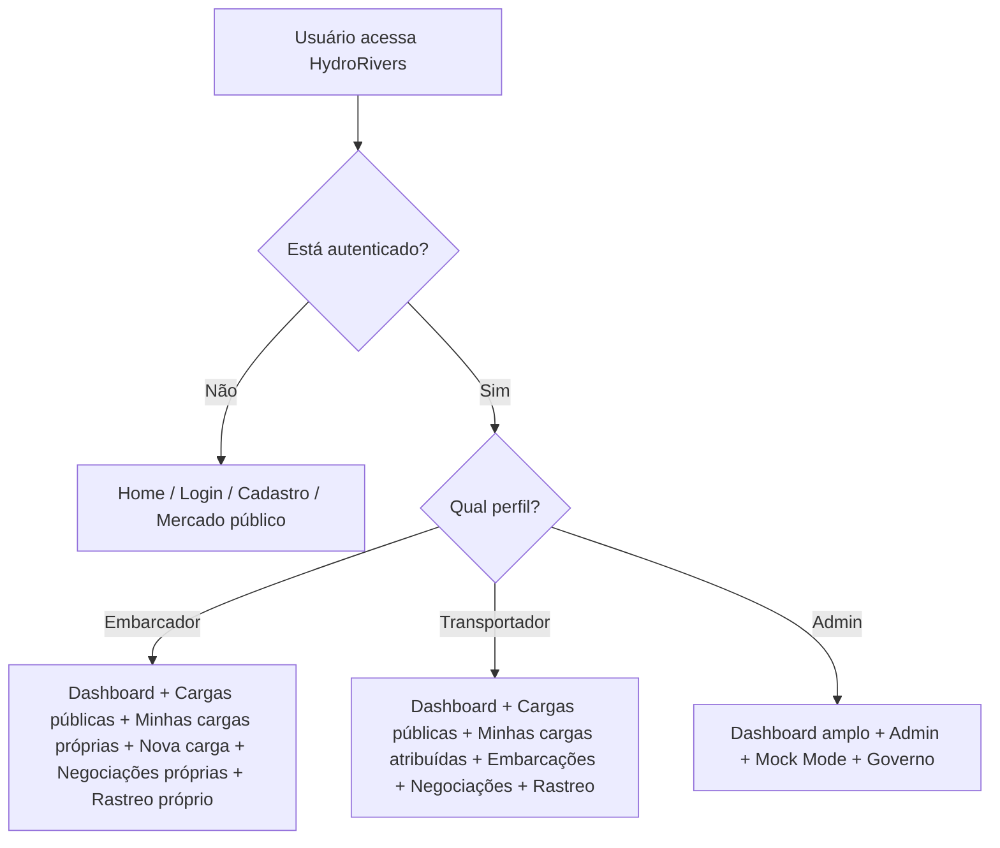
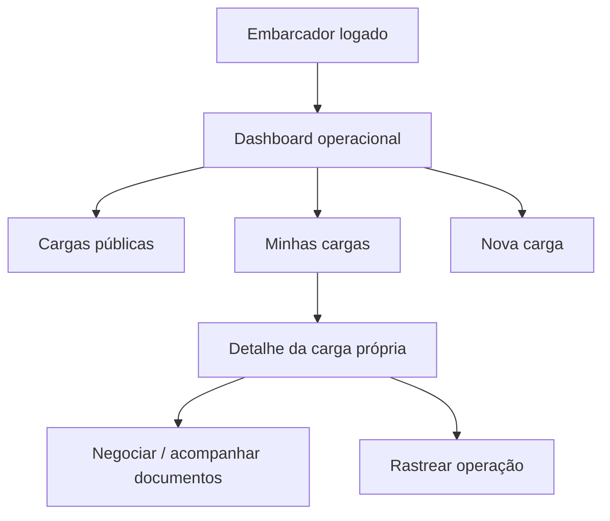
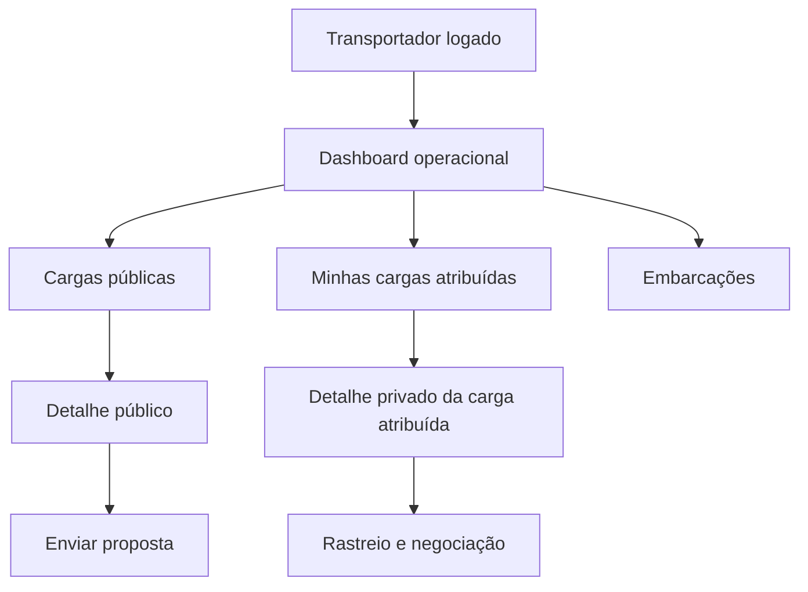
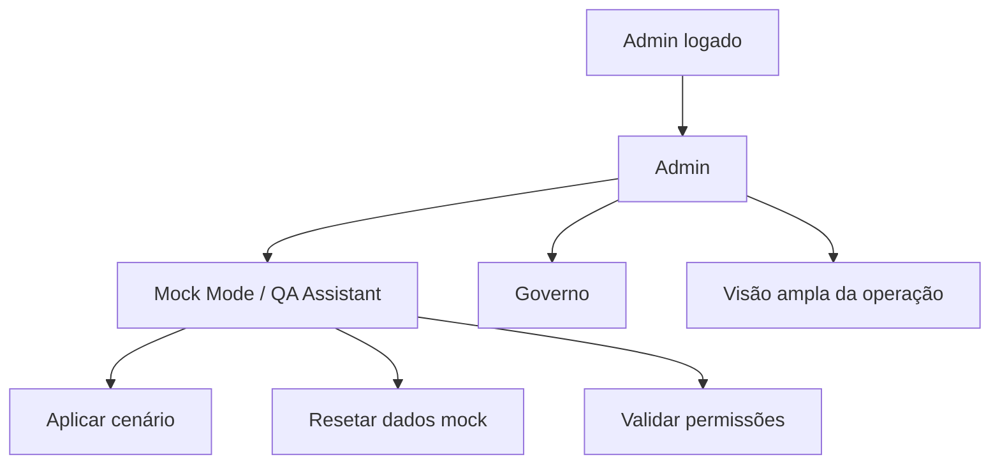

# Papéis, permissões e casos de uso

## Visão geral

## Embarcador

## Transportador

## Admin e QA

## Regras por área

| Área | Embarcador | Transportador | Admin | Governo |
|---|---|---|---|---|
| Dashboard | Visão da própria operação | Operação + frota | Ampla | Agregada |
| Cargas | Marketplace público | Marketplace público | Ampla | Limitada ou não aplicável |
| Minhas cargas | Próprias cargas | Cargas atribuídas | Visão ampla se aplicável | Não acessa dados privados |
| Nova carga | Pode criar | Normalmente não cria | Pode criar | Não |
| Negociações | Próprias | Enviadas/recebidas | Ampla | Não |
| Embarcações | Relacionadas à operação | Frota | Ampla | Agregada |
| Rastreio | Próprio | Cargas atribuídas | Amplo | Agregado |
| Impacto | Próprio/agregado | Operacional | Amplo | Institucional |
| Governo | Se houver visão pública | Se houver visão pública | Acesso | Acesso principal |

## Observação de produto

- O embarcador compra/organiza carga.
- O transportador oferta capacidade e opera frota.
- O admin supervisiona e valida.
- O governo consome visões agregadas e institucionais, nunca dados privados sem regra explícita.
